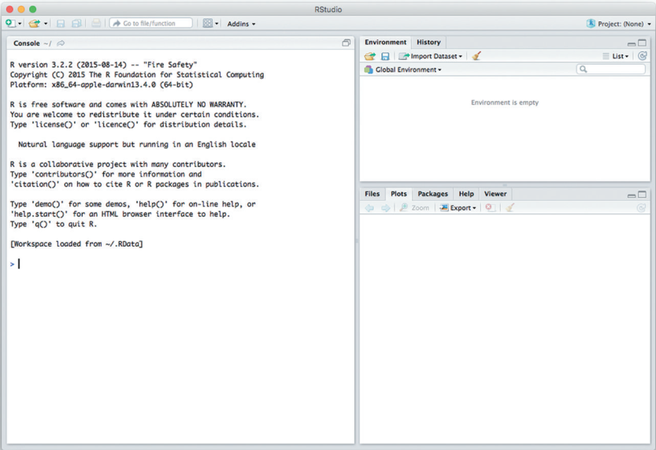
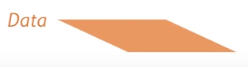
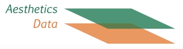
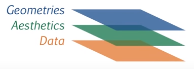
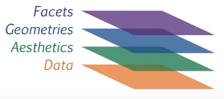
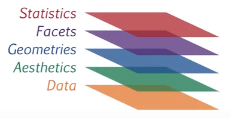
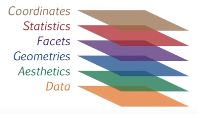
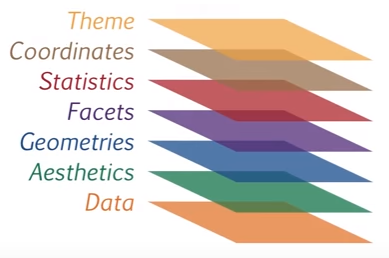

```{r knitr_init, echo=F, cache=FALSE}
library(knitr)
library(rmdformats)

## Global options
options(max.print="75")
opts_chunk$set(echo=T,fig.align="center",
	             cache=F,
               prompt=FALSE,
               tidy=F,
               comment=NA,
               message=FALSE,
               warning=FALSE)
opts_knit$set(width=75)
```

<!-- Para poder trabajar con columnas: 
https://stackoverflow.com/questions/31753897/2-column-section-in-r-markdown
-->

<style>
  .col2 {
    columns: 2 200px;         /* number of columns and width in pixels*/
    -webkit-columns: 2 200px; /* chrome, safari */
    -moz-columns: 2 200px;    /* firefox */
  }
  .col3 {
    columns: 3 100px;
    -webkit-columns: 3 100px;
    -moz-columns: 3 100px;
  }
  .column2-left{
    float: left;
    width: 50%;
    text-align: left;
  }
  .column2-right{
    float: right;
    width: 50%;
    text-align: right;
  }
  .column3-left{
    float: left;
    width: 33%;
    text-align: left;
  }
  .column3-center{
    display: inline-block;
    width: 33%;
    text-align: center;
  }
  .column3-right{
    float: right;
    width: 33%;
    text-align: right;
  }
</style>

# Generalidades

## Qué es R

- *R* es un lenguaje de programación orientado a la realización de procesos estadísticos y gráficos.
- Es un software libre, se distribuye bajo la licencia *GNU GPLv2* que establece las siguientes *libertades*:

    - Libertad de usar el programa con cualquier propósito.
    - Libertad de ver cómo fue hecho, cómo funciona y modificarlo.
    - Libertad de distribuir copias.
    - Libertad de publicar modificaciones y agregados para que estén disponibles para la comunidad.

- *R* tiene una comunidad de usuarios muy activa, de las más diversas áreas, con muchos blogs, portales y encuentros en persona para recibir ayuda:

    - [R en Rosario](https://renrosario.rbind.io)
    
    - Blogs y portales de ayuda:
    
        - [Stack Overflow](http://stackoverflow.com/tags/r/info)
        - [R Bloggers](https://www.r-bloggers.com/)
        - [Quick R](https://www.statmethods.net/index.html)
        - [R Bloggers](https://www.r-bloggers.com/)
        - [Cookbook for R](http://www.cookbook-r.com/)
        - [STHDA](http://www.sthda.com/english/wiki/r-software)
        - Muchos más...
    
    - Cheatsheets (machetes), por ejemplo, los de [RStudio](https://www.RStudio.com/resources/cheatsheets/)
    
    - Material de clases que están online, por ejemplo, [STATS545](http://stat545.com/topics.html)
    
    - Twitter con el hashtag [rstats](https://twitter.com/hashtag/rstats)

## Qué es RStudio

- RStudio es un entorno de desarrollo integrado (IDE) para R.
- RStudio facilita el uso interactivo que es característico de R, a través del cual se suele intercalar la ejecución de sentencias con la visualización de los resultados mientras avanza en su análisis o solución del problema.
- Entre otras cosas, RStudio:

    - permite abrir y editar varios archivos a la vez
    - incluye autocompletado y resaltador de código
    - permite ejecutar porciones de código con sólo seleccionarlos en el programa
    - muestra el workspace (todos los elementos que hemos creado con nuestro programa)
    - muestra el historial de sentencias ejecutadas
    - integra ayuda y documentación
    - integra la gestión de paquetes adicionales
    - gestiona proyectos de trabajo
    - gestiona gráficos
    - se conecta a la línea de comandos de la compu
    - etc

## Cómo instalar R y RStudio

- Visitar las páginas oficiales de [R](https://www.r-project.org/) y de [RStudio](https://www.rstudio.org/), descargar los instaladores y ejecutarlos, siguiendo las indicaciones que aparecen. 
- Ejemplo en este [video](https://www.youtube.com/watch?v=qpnDeWHwYA0).

## Usar RStudio

- Cuando se abre RStudio por primera vez se pueden visualizar tres paneles: 

```{r, out.width='70%', fig.cap='Captura de pantalla de RStudio', echo=FALSE}

```

- A la izquierda, la **consola**. Es la ventana que se comunica con el motor de R. A través de ella se envían las instrucciones o *sentencias* a R y se visualizan los resultados.
- Arriba a la derecha, panel con las pestañas:

    - **Environment** (*ambiente*): muestra todas las cosas (*objetos*) que R tiene en la cabeza (*memoria*), como conjuntos de datos, modelos, resultados, etc. 
    - **History** (*historial*): lista todas las instrucciones que R ha corrido.
    - **Connections** (*conexiones*): muestra todas las conexiones activas a bases de datos remotas, establecidas por ej. mediante servidores SQL (esta pestaña puede no aparecer, dependiendo de la versión del programa que tengamos instalada)

- Abajo a la derecha: panel con las pestañas **Files**, **Plots**, **Packages**, **Help** y **Viewer**.

- Si bien podemos escribir nuestras sentencias en la consola y dar *enter* para que se ejecuten, en general queremos que queden escritas y guardadas en un archivo de código llamado **script**.
- Un *script de R* es un archivo de texto con extensión *.R* que tiene almacenadas sentencias en el lenguaje R. 
- En RStudio podemos crear uno nuevo yendo a *Archivo -> Nuevo Archivo -> R Script*. La consola se achica para dejar lugar arriba a la izquierda al editor de texto donde podemos escribir nuestro código y guardarlo en la compu como a cualquier otro archivo. Podemo abrir varios scripts a la vez.
- Una vez que escribimos una sentencia en el script, podemos *correrla* (es decir, enviarla a la consola para que se ejecute) haciendo click en el ícono *Run* o con el atajo *Ctrl+Enter*. De esta forma, se *corre* la línea en la cual está el cursor o las líneas que hayamos seleccionado.
- El símbolo numeral (#) se utiliza para incluir **comentarios** en el script, es decir, líneas que no serán ejecutadas en las cuales podemos escribir explicaciones o aclaraciones para nosotros mismos u otros. Si *corremos* líneas que empiezan con #, R no hará nada con ellas, las salteará.


# Conceptos elementales

## Diseño del sistema R

Se divide en dos partes:

- La **base** ("base R System"): se descarga desde [CRAN](https://cran.r-project.org/) ("Comprehensive R Archive Network"). Contiene, entre otras cosas, una serie de paquetes que contienen todas las funciones básicas y fundamentales de R.

- El **resto**: incluye miles de paquetes con funcionalidad específica que el usuario puede elegir descargar también desde CRAN.

    - La pestaña *Packages* del panel de abajo a la derecha tiene el listado de todos los paquetes que ya están instalados y tiene un botón para instalar nuevos.
    - Otra opción para instalar un paquete es correr la sentencia: `install.packages("nombredelpaquete")`, por ejemplo, `install.packages("ggplot2")`.
    - Un paquete se instala una sola vez, pero cada vez que lo queramos usar debemos *cargarlo* para que las herramientas que trae queden a nuestra disposición. Eso se hace con la sentencia `library("nombredelpaquete")`, por ejemplo, `library("ggplot2")`.

## Uso básico: como una calculadora

- R puede dividir, multiplicar, sumar, restar, calcular potencias, logaritmos, raíces y mucho más. Ejemplos:

```{r}
1 + 2
5 * 3
exp(2)
sqrt(100)
1 / 0
(2 + 3i) * (3 + 6i)
1i ^ 2
```

## Funciones

- En programación, se usan **funciones** para agrupar un conjunto de sentencias que se desean usar repetidamente o que, por causa de su complejidad, es más conveniente que estén contenidas en un sub programa que se llame cuando sea necesario. 
- Una **función** es una pieza de código escrito para llevar adelante una tarea específica, que puede o no requerir *argumentos* o *parámetros* y devolver como resultado uno o más valores.
- En R, las funciones están representadas por una palabra (o palabras combinadas pero sin espacios), seguida por los paréntesis `()`.
- Dentro de los paréntesis se colocan las porciones de información que queremos compartir con la función, que reciben el nombre de **argumentos** y que si son más de uno se separan con coma.
- En los ejemplos anteriores hemos utilizado algunas funciones muy básicas que ya vienen incorporadas en R y que realizan operaciones matemáticas: `log()`, `exp()` y `sqrt()`. Todas ellas requieren al menos que proveamos un argumento entre los paréntesis, en este caso, el número al cual queremos aplicarle la operación.
- Por ejemplo, *llamamos* a la función `log` con el argumento `10`:

```{r}
log(10)
```

- Esta función calcula, por default, el logaritmo natural. ¿Y qué pasa si yo quiero el logaritmo con base 10?
- Buscamos en el panel de **Ayuda** la función `log` y vemos cuáles son los otros argumentos que podemos utilizar. Ahí nos damos cuenta de que está la opción de elegir la base de esta forma:

```{r}
log(10, base = 10)
```

- Otra forma de abrir la ayuda para una función es correr alguna de estas sentencias:

```{r, eval=FALSE}
help(log)
?log
```

- También podemos pedir ejemplos de cómo usar una función:

```{r, eval=FALSE}
example(log)
```

## Objetos

- En los ejemplos anteriores, le hemos pedido a R algunas cosas para que las muestre en la consola, pero no quedaron guardadas en ningún lado.
- En general, deseamos guardar el resultado de una operación para utilizarlo más adelante.
- Para lograr esto, hay que pedirle a R que **asigne** el resultado a un **objeto**.
- Un **objeto** es una estructura de datos especializada.
- Por ejemplo:

```{r}
x <- seq(from = 1, to = 10, by = 2)
```

- Hemos creado un objeto llamado `x` que es una estructura que contiene una secuencia de datos numéricos.
- Al nombre del objeto se le dice *símbolo* o *variable*, en general vamos a preferir usar nombres que sean descriptivos del tipo de información que guardamos, pero que no sean muy largos.
- La asignación se realiza con el operador *flechita* `<-` o con `=`. 
- Podemos ver que R ha creado en su memoria al objeto `x` en el listado del panel **Environment**. Allí estarán todos los objetos que vayamos creando.
- Todo lo que existe en R es un **objeto** y todo lo que sucede se realiza a través de **funciones** que operan sobre los objetos.

## Workspace (ambiente de trabajo)

- Todos los objetos que vamos creando existen en la memoria de R, a la que llamamos *workspace* (ambiente de trabajo).
- Podemos ver todos los objetos creados en el listado del panel **Environment** o corriendo `ls()`.
- Podemos eliminar cualquier objeto con `rm()`, por ejemplo, `rm(x)`.
- Podemos eliminar todos los objetos del workspace (con cuidado) usando `rm(list = ls())` o con el ícono de la escoba en la pestaña **Environment**.
- Las funciones `save()`, `save.image()` y `load()` permiten guardar un objeto o todo el workspace como un archivo en la compu y luego poder cargarlo en R en cualquier otro momento, respectivamente.

## Working Directory (directorio o carpeta de trabajo)

- R siempre trabaja mirando a alguna carpeta dentro de tu computadora.
- Esto quiere decir que puede ver y acceder de manera directa a todas las cosas que haya allí.
- A esta carpeta se le dice **working directory** (directorio de trabajo) y por default suele ser la carpeta *Documentos* o alguna equivalente.
- A menos que le indiquemos lo contrario, los objetos de R que guardemos quedarán allí, o a la hora de importar algún objeto (como un archivo) R primero lo buscará allí.
- Ver cuál es mi working directory actual:

```{r}
getwd()
```

- R está posando sus ojos allí, de hecho, me puede decir qué tengo en esa carpeta:

```{r}
list.files()
```

- Pero podemos cambiar el working directory por cualquier otra carpeta en la que queramos estar trabajando:

```{r, eval=FALSE}
setwd("C:/OtraCarpeta/")
```

## Tipos de datos

- Hay tres tipos de datos básicos que podemos almacenar en los objetos de R:
    - *numeric* (números reales)
    - *character* (texto)
    - *logical* (valores lógicos, `TRUE` o `FALSE`)

- `class()` nos indica qué tipo de datos tenemos:

```{r, tidy = T}
a <- 2
b <- "Hola Mundo"
c <- TRUE
d <- pi
e <- "Soy una frase"
f <- FALSE
class(a)
class(b)
class(c)
class(d)
class(e)
class(f)
```

Otra forma de conocer el tipo de dato es usando las funciones `is.`:

```{r, tidy = T}
is.numeric(a)
is.character(b)
is.logical(f)
is.numeric("Rosario")
is.character(TRUE)
is.logical(2013)
```

- Además de `TRUE` y `FALSE`, R cuenta un valor lógico muy particular para representar *datos faltantes*: `NA` (*Not Available*)

```{r, tidy = T}
g <- NA
class(g)
is.na(g)
g + 3
```

- Dependiendo del tipo de dato que almacenan, los objetos pueden ser usados en ciertas funciones y no en otras.

```{r}
obj1 <- 3
obj2 <- 4
obj1 + obj2
obj3 <- "hola"
obj4 <- "chau"
```
```{r, eval=FALSE}
obj3 + obj4
Error in obj3 + obj4 : non-numeric argument to binary operator
```

# Vectores, matrices y listas

Los **vectores**, **matrices** y **listas** son distintas estructuras para contener conjuntos ordenados de datos.

## Vectores

- Un **vector** es un conjunto ordenado de datos del mismo tipo (por ejemplo, números).
- La función `c()` se usa para crear vectores:

```{r, tidy = TRUE}
x <- c(3, 1, 6)
x
y <- c(x, 0, x)
y
z <- c(1:5, 5:1)
z
frase <- c("me", "gusta", "aprender", "R")
frase

# Largo de un vector
length(y)
length(frase)
```

- Muchas de las funciones de R están vectorizadas, es decir, admiten un vector como argumento y R operan sobre cada uno de ellos:

```{r, tidy = TRUE}
x <- c(1, 2, 3)
1 / x
x * 2
x - 15
x / 2
x %% 3
x > 2
```

- **Indexación de vectores**: indexar es hacer referencia a uno o más elementos particulares dentro de una estructura de datos.

```{r, tidy = T}
x <- c(10.4, 5.6, 3.1, 6.4, 21.7)

# Mostrar sólo el primer elemento
x[1]

# Mostrar los primeros tres elementos
x[1:3]

# Mostrar los elementos en las posiciones 2 y 4
x[c(2, 4)]

#Mostrar todos los elementos menos el cuarto
x[-4]

# Indexar con valores lógicos
x[x > 10]
```

- A cada elemento de un vector se le puede asignar un nombre y usar ese nombre para indexar:

- Cada elemento de un vector en R puede tener su propio *nombre*:
    
```{r, tidy = TRUE}
frutas <- c(3, 7, 2, 1)
frutas
names(frutas)
names(frutas) <- c("manzana", "naranja", "banana", "pera")
frutas
frutas["naranja"]
frutas[c("naranja", "pera")]
```

## Matrices

- Una matriz es una colección de datos arreglados como una tabla bidimensional. 
- Al igual que los vectores, todos los elementos de una matriz deben ser del mismo tipo (numérico, carácter, lógico, etc). 
- La función `matrix()` se usa para crear matrices:

```{r}
A <- matrix(c(4,-2, 1, 20, -7, 12, -8, 13, 17), nrow = 3)
A
dim(A)
ncol(A)
nrow(A)
length(A)
```

- Indexar una matriz es similar a indexar un vector, pero dentro de los corchetes debemos emplear dos índices, separados con comas, por ejemplo: [2, 4]. El primero indica la fila y el segundo la columna. 
- Si delante de la coma no colocamos nada, entonces nos quedamos sólo con la columna indicada, por ejemplo: [ , 1] selecciona la columna 1. De la misma forma, si detrás de la coma no ponemos nada, estaremos indexando una fila completa, por ejemplo [1, ] selecciona la fila 1.

```{r}
A[2, 3]
A[2, ]
A[, 3]
```

- Se usan las funciones `cbind()` y `rbind()` para concatenar matrices por columnas o filas, siempre que sus dismensiones sean compatibles.

```{r}
B <- matrix(1:9, nrow = 3, byrow = T)
cbind(A, B)
rbind(A, B)
```

- Se le puede asignar nombres a las filas y columnas, y usarlos para indexar:

```{r}
rownames(A) <- c("Fila1", "Fila2", "Fila3")
colnames(A) <- c("Col1", "Col2", "Col3")
A
A["Fila2", "Col3"]
A["Fila2", ]
A[, "Col3"]
```

## Listas

- Una **lista** es una estructura de datos que reune a varios objetos de R.
- Podemos imaginarla como una bolsa en la que podemos meter distintos tipos de objetos:

```{r}
miLista <- list(A, c(3, 5, 7), "hola")
miLista
length(miLista)
```

- Podemos asignarle un nombre a cada objeto en la lista:

```{r}
miLista <- list(matrizA = A, miVector = c(3, 5, 7), palabra = "hola")
miLista
```

- Podemos indexar para seleccionar un elemento de la lista de distintas formas:

```{r}
miLista[[2]]
miLista[["miVector"]]
miLista$miVector
```

# Operadores lógicos

| Operador |    Significado    |                   Observaciones                   |
|:--------:|:-----------------:|:-------------------------------------------------:|
|    ==    |       Igual       |                                                   |
|    !=    |      No igual     |                                                   |
|     <    |     Menor que     |                                                   |
|     >    |     Mayor que     |                                                   |
|    <=    | Menor o igual que |                                                   |
|    >=    | Mayor o igual que |                                                   |
|     \|   |         O         | Devuelve TRUE si se cumple al menos una condición |
|     &    |         Y         | Devuelve TRUE si se cumplen todas las condiciones |


Ejemplos:

```{r}
x <- c(2, 1, 8, 2, 9)
x >= 8
x == 2
x != 2
x < 3 | x == 8
x > 3 & x < 9
```

# Estructuras de control

- Se conocen como **Estructuras de Control** a ciertas construcciones que permiten manejar el flujo de nuestro código.
- Sirven cuando queremos elegir el comportamiento de las sentencias basándonos en resultados que no conocemos de antemano o para repetir ciertas partes, un número determinado de veces o hasta que se verifique alguna condición.
- Todas estas opciones pueden implementarse en R aplicando estructuras de control del tipo `if else`, `while` o `for`

## Ejecuciones condicionales de tipo *if else*

- Los *if statements* son expresiones útiles que nos ayudan a tomar un determinado camino basándonos en el resultado de una operación lógica.
- Estas estructuras evalúan si una o varias condiciones son verdaderas o falsas, actuando en consecuencia según lo definido por el usuario.
- Ejemplo:

```{r}
# Caso 1
a <- 30
b <- 7
if (a <= b) {
    cat("El número más chico vale", a)
} else {
    cat("El número más chico vale", b)
}

# Caso 2
a <- 30
b <- 40
if (a <= b) {
    cat("El número más chico vale", a)
} else {
    cat("El número más chico vale", b)
}
```

- No es obligatorio definir un resultado en caso de que la condición evaluada sea falsa, es decir, no hace falta incluir la estructura *else*.

```{r}
a <- 30
b <- 7
if (a <= b) {
    cat("El número más chico vale", a)
}
# No ocurre nada porque la operación fue evaluada como FALSE
```

- Pueden anidarse varias opciones con las estructuras *if-else if-else*:

```{r}
error = 120.1
if (error < 1) {
    cat("El error es pequeño")
} else if (error < 10) {
    cat("El error es mediano")
} else {
    cat("El error es grande")
}
```

## Estructuras de control iterativas: *while*

- Las estructuras de control iterativas se utilizan cuando se desea ejecutar un conjunto de sentencias varias veces.
- Un ejemplo de este tipo es la función `while()`, que chequea al inicio de cada iteración si una condición prefijada es cierta o no.
- El código se ejecuta si esta condición se cumple, repitiendo el proceso hasta que el criterio fijado sea falso.
- Por ejemplo:

```{r}
a = 320
while (a > 10) {
    print(a)
    a <- a / 2
}
```

- Hay que tener cuidado, en algún momento la condición debe ser falsa para que el proceso pueda terminar! Caso contrario, la sesión de R se puede tildar... por ejemplo:

```{r eval=FALSE}
a = 8
while (a < 10) {
    print("No hagan esto en sus casas! Tampoco en la facultad!!!")
    a = a / 2
}
```

## Estructuras de control iterativas: *for*

- Empleamos una estructura *for* cuando sabemos de antemano cuántas veces queremos que se repita el código:

```{r}
for (j in 1:5) {
    res <- j * 2 + 3
    print(res)
}
```

- En el ejemplo anterior, `j` cumple el rol de *iterador*. En cada repetición, su valor irá cambiando tomando cada uno de los valores definidos en el vector que sigue a la palabra clave `in`.
- En el siguiente ejemplo, usamos un `for()` para sumar todos los números de un vector:

```{r}
numeros <- c(2, 4, 3, 1, 7, 10, 5)
rtdo <- 0
for (x in numeros) {
    cat("El resultado actual es", rtdo, "y ahora le voy a sumar", x, "\n")
    rtdo <- rtdo + x
}
rtdo
```

# Creación de funciones

- Además de las funciones que ya vienen en R, podemos crear las nuestras propias.
- Por ejemplo, pensemos en la función matemática $f(x, y) = x^2 + 2y$. Podemos definirla en R así:

```{r}
f <- function(x, y) {
    rtdo <- x^2 + 2 * y
    return(rtdo)
}
```

- Una función se crea eligiendo un nombre para ella (`f`), con la palabra clave `function`, seguida entre paréntesis por los argumentos que necesita para operar y finalmente entre llaves todas las líneas con las sentencias a ejecutar.
- En el ejemplo, hacemos la cuenta y la guardamos en el objeto `rtdo`. Luego, indicamos que al finalizar, la función debe devolver (`return`) ese valor.
- Ahora podemos usarla cuantas veces queramos:

```{r}
f(2, 3)
f(0, 1)
```

- Si bien no es necesario, podemos aclarar a qué argumento le enviamos cada valor:

```{r}
f(2, 3)
f(x = 2, y = 3)
f(y = 3, x = 2)     # avisando el nombre del argumento, podemos escribirlos en cualquier orden!
```

- En la definición de la función, podemos asignarles a algunos o todos los argumentos valores *por default*. 
- Si al invocar la función no especificamos un valor para ese argumento, tomará el valor default:

```{r}
f <- function(x, y = 10) {
    rtdo <- x^2 + 2 * y
    return(rtdo)
}
f(x = 2, y = 3)     # especificamos y, no toma en cuenta el valor default
f(x = 2)            # no especificamos y, tomará el valor default 10
```
```{r, eval = F}
f(y = 3)            # x no tiene valor por default, sí o sí tenemos que pasarle un valor
Error in f(y = 3) : argument "x" is missing, with no default
```

- Una función puede devolver más de un objeto si los englobamos dentro de una lista:

```{r}
fun <- function(x, y) {
    sumo <- x + y
    resto <- x - y
    multiplico <- x * y
    rtdo <- list(sumo, resto, multiplico)
    return(rtdo)
}
fun(2, 3)
```

- Analizar el siguiente ejemplo, donde definimos una función para calcular factoriales:

```{r, tidy = F}
factorial <- function(x, sacarLog = FALSE) {
    
    # Chequear: x es entero no negativo?
    if(x < 0 | x != floor(x)) {
        stop("x debe ser un entero mayor o igual a cero")
    }
    
    if (x == 0) {
        # El factorial de 0 es 1, terminamos rápido
        rtdo = 1
    } else {
        # Calcular el factorial: 1 * 2 * 3 * ... * x 
        rtdo <- 1
        for (i in 1:x) {
            rtdo <- rtdo * i
        }
    }

    # Chequear si quieren que le calculemos el log (sin sentido, sólo para mostrar un ejemplo)
    if (sacarLog) rtdo = log(rtdo)
    
    # Finalizar
    return(rtdo)
}
```

```{r, eval=F}
factorial(-5)
Error in factorial(-5) : x debe ser un entero mayor o igual a cero
factorial(2.3)
Error in factorial(2.3) : x debe ser un entero mayor o igual a cero
```

```{r}
factorial(0)
factorial(5)
factorial(5, sacarLog = TRUE)
```

# Conjuntos de datos (*datasets*)

- **Nota:** en este taller no nos dedicaremos a analizar datos, por lo cual este material no cubre la importación y manejo de datasets en R. Sólo presentaremos algunas nociones básicas dado que el sistema gráfico que utilizaremos, el paquete *ggplot2* hace uso de datasets.
- Un **dataset** en R es una estructura con formato tabular para almacenar datos donde cada columna corresponde a una variable y cada fila a un individuo u observación.
- Podemos pensar que cada columna del dataset es un vector de datos de un tipo determinado (numéricos, caracter, lógico, etc) y que el dataset es una lista que reúne a todos estos vectores.
- R trae algunos datasets de ejemplo para que podamos experimentar con ellos, por ejemplo, el dataset llamado **iris** que contiene datos sobre tres especies de la planta de iris. 
- Cargamos los datasets de ejemplo con la función `data()` y podemos ver que aparece en el *environment*.

```{r}
data(iris)
```

- Así como al ejecutar, por ejemplo, `x <- c(3, 1, 4)` estamos creando un objeto llamado `x` que es un vector de clase numérica (como lo indica `class(x)`), un dataset es otro tipo de objeto cuya clase es *data.frame*:

```{r}
class(iris)
```

- Según su clase, a cada objeto se le pueden aplicar ciertas funciones. Algunas funciones útiles para explorar los objetos de clase *data.frame* son:

```{r}
dim(iris)
ncol(iris)
nrow(iris)
str(iris)
summary(iris)
head(iris)
tail(iris)
```

- Podemos crear un dataset a partir de vectores de esta forma:

```{r}
misDatos <- data.frame(
    altura = c(181, 165, 149, 178),
    peso = c(85, 65, 52, 72),
    edad = c(29, 27, 21, 32)
)
misDatos
```

- Otra forma de crear datasets es con el paquete *dplyr*.

```{r}
library(dplyr)
misDatos <- tibble(
    altura = c(181, 165, 149, 178),
    peso = c(85, 65, 52, 72),
    edad = c(29, 27, 21, 32)
)
misDatos
class(misDatos)
```

- Como se puede ver, un *tibble* es un objeto de clase *data.frame*, pero también de clase *tbl*. Esto quiere decir que tiene las mismas características que un *data.frame*, pero con algunos agregados muy útiles.
- Para lo que hagamos en el Taller, cualquiera de los dos formatos de datasets, *data.frame* o *tibble* nos servirán por igual y puede ser que aparezca uno u otro.
- El paquete *dplyr* forma parte de una familia de paquetes conocida como *tidyverse* [tidyverse](https://www.tidyverse.org/), creada por los desarrolladores de RStudio para la manipulación, exploración y visualización de datos con un diseño, estructuras y reglas en común.
- *Base R*, es decir, la instalación original, ya trae muchas funciones para manejar datasets, pero *tidyverse* provee, a través de la instalación de paquetes, un enfoque más moderno y práctico. Para seguir aprendiendo, sería recomendable buscar tutoriales en internet de *tidyverse*, en especial de los paquetes *dplyr* y *tidyr*.

# Gráficos con **ggplot2**

- En R existen tres sistemas para realizar gráficos: **base**, **lattice** y **ggplot2**.
- El sistema **base** incluye funciones que ya vienen en *R base* y permite realizar de manera rápida gráficos simples. Tienen una apariencia muy sencilla y si bien con cierto trabajo se pueden mejorar y complejizar, es el sistema más limitado en cuanto a sus potencialidades.
- El sistema **lattice** viene también en la instalación base de R pero para utilizarlo hay que cargar un paquete con ese nombre: `library(lattice)`. Añade mucha más flexibilidad, pero su sintaxis es poco clara e intuitiva, o al menos menos que **ggplot2**, el sistema que describiremos ahora.

## La gramática de los gráficos

- **gg** viene de *Grammar of Graphics*, una estructura ideada por Leland Wilkinson (*Grammar of Graphics*, 1999).
- Así como la gramática de un lenguaje estudia la estructura de las palabras, la manera en que se combinan y las reglas que hay que seguir para formar oraciones, la gramática de gráficos provee un sistema para combinar elementos gráficos que den como resultado figuras para mostrar datos de manera visualmente significativa.
- Este sistema fue popularizado por Hadley Wickham (CEO de RStudio) cuando creó el paquete para R **ggplot2** basándose en estas ideas.
- Los gráficos de **ggplot2** se construyen tomando como base esta gramática, que consta de dos principios fundamentales:

	- Los gráficos están formados por distintas **capas** (*layers*) de elementos *gramaticales* o gráficos.
	- Las capas se vinculan entre sí a través de un **mapeo estético** (*aesthetic mapping*)

- Las **capas** son como los adjetivos o sustantivos y el **mapeo estético** es como el conjunto de reglas gramaticales que ayudan a ensamblar ese vocabulario.
- Hay 7 tipos elementos gráficos, pero los 3 esenciales, de presencia obligatoria, son:

	 - **Datos** (*data*): los datos que queremos representar
	 - **Aesthetics** (*aes*): describe cómo las variables en el data set se mapean (vinculan) a las propiedades visuales (*aesthetics*). Por ejemplo, cuál es la variable que van en el eje horizontal, cuál en el vertical, cuál la que indica de qué color va cada punto, etc.
	 - **Geometrías** (*geometries, geom*): el aspecto o forma que los datos van a tomar en el gráfico (puntos, líneas, boxplots, etc.).

- Los restantes tipos de elementos son:

	- **Facetas** (*facet*): para graficar con paneles (por grupos).
	- **Estadísticas** (*stats*): para agregar estadísticas o resultados de métodos estadíticos (como una curva ajustada).
	- **Coordenadas** (*coordinates*): para transformar el espacio sobre el cual se grafican los datos (ej: escala logarítmica, coordenadas polares, etc.).
	- **Temas** (*themes*): "tinta libre de datos" (*non-data ink*), controla el aspecto general (es lo que uno llamaría intuitivamente la parte estética).

## Un ejemplo

- Un gráfico se inicia con la función `ggplot()`, en la cual se definen los dos primeros elementos obligatorios.
- En primer lugar, tenemos que elegir qué dataset queremos graficar, en nuestro caso tomaremos a *iris*:

```{r, echo=F}

```
```{r, echo=T}
head(iris)
```

- El otro elemento a incluir en la función `ggplot()` incluye las **aesthetics**, donde indicaremos los mapeos que utilizaremos para vincular las distintas capas.
- Vamos a hacer un diagrama de dispersión de `Sepal.Length` vs `Sepal.Width`, por lo que vamos a mapear la variable `Sepal.Width` al elemento estético $x$ y la variable `Sepal.Length` al elemento estético $y$:

```{r, echo=F}

```
```{r, echo=T}
library(ggplot2)
ggplot(iris, aes(x = Sepal.Width, y = Sepal.Length))
```

- Como podemos ver, el gráfico está vacío porque a pesar de que elegimos qué poner en cada eje, no indicamos cómo queremos que aparezcan los datos. Nos falta el tercer elemento obligatorio, un **geometry**, sin al menos una capa con un geometry no tenemos ningún gráfico!
- Agregamos nuevas capas con el operador `+`
- Por ejemplo, para un gráfico de dispersión, lo que necesitamos son puntos:

```{r, echo=F}

```
```{r, echo=T}
ggplot(iris, aes(x = Sepal.Width, y = Sepal.Length)) +
    geom_point()
```

- A partir de acá podemos considerar incluir o no los restantes elementos gramaticales opcionales.
- Por ejemplo, podemos agregar un elemento tipo **facet** para hacer un panel para cada especie:

```{r, echo=F}

```
```{r, echo=T, tidy=F}
ggplot(iris, aes(x = Sepal.Width, y = Sepal.Length)) +
    geom_point() + 
    facet_wrap(~ Species)
```

- Podemos agregar una nueva capa con un elemento de tipo *stats*, por ejemplo para agregar la recta de regresión lineal simple:

```{r, echo=F}

```
```{r, echo=T, tidy=F}
ggplot(iris, aes(x = Sepal.Width, y = Sepal.Length)) +
    geom_point() + 
    facet_wrap(~ Species) +
    stat_smooth(method = "lm")
```

- Ahora podemos hacer algo con las **coordinates**, agregando una capa para el eje horizontal y otra para el eje vertical con el fin de cambiar los ejes:

```{r, echo=F}

```
```{r, echo=T, tidy=F}
ggplot(iris, aes(x = Sepal.Width, y = Sepal.Length)) +
    geom_point() + 
    facet_wrap(~ Species) +
    stat_smooth(method = "lm") + 
    scale_x_continuous("Ancho del pétalo", limits = c(2, 5)) +
    scale_y_continuous("Largo del pétalo", limits = c(4, 8), breaks = seq(4, 8, 2))
```

- Finalmente podemos modificar el aspecto general con una o varias capas de **estilo** (con estilos predefinidos o personalizados):

```{r, echo=F}

```
```{r, echo=T, tidy=F}
ggplot(iris, aes(x = Sepal.Width, y = Sepal.Length)) +
    geom_point() + 
    facet_wrap(~ Species) +
    stat_smooth(method = "lm") + 
    scale_x_continuous("Ancho del pétalo", limits = c(2, 5)) +
    scale_y_continuous("Largo del pétalo", limits = c(4, 8), breaks = seq(4, 8, 2)) +
    theme_bw()
```

## Algunas opciones útiles para el Taller de Métodos Numéricos

### Modificar las opciones por default de un geometry

- Por ejemplo, cambiar la forma y el color de los puntos

```{r}
ggplot(iris, aes(x = Sepal.Width, y = Sepal.Length)) + 
    geom_point(color = "red", size = 2, shape = 23)
```

- Guía de símbolos:

```{r, echo=F}
knitr::include_graphics("Plots/IntroR/points-symbols.png")
```

### Modificar los mapeos *aesthetics*

- En el ejemplo anterior, hemos modificado la forma, el color y el tamaño para todos los puntos (*aesthetics setting*).
- Esas son **especificaciones estéticas fijas** que se definen dentro del *geom* correspondiente (*geom_point*) y no forman parte de la función `aes()`.
- Por ejemplo, le asignamos un valor, el color `red` al argumento `color` de la función `geom_point`.
- Otra cosa distinta es emplear **especificaciones de mapeo estético** (*aesthetics mapping*). Estas se definen dentro de la función `aes()` y afectan a todas las capas del gráfico.
- Por ejemplo, si quiero que a través de todas las capas el color esté "mapeado" a la variable `Species` para que cada uno de los grupos tenga su propio color, deberé agregar `aes(color = Species)`.
- Esto inmediatamente genera el mapeo que asocia al color de todos nuestros *geoms* con la variable `Species` y crea automáticamente la correspondiente leyenda.

```{r}
ggplot(iris, aes(x = Sepal.Width, y = Sepal.Length, color = Species)) +
    geom_point(size = 2)
```

- Podemos asociar también la forma de los puntos a la especie:

```{r}
ggplot(iris, aes(x = Sepal.Width, y = Sepal.Length, color = Species, shape = Species)) +
    geom_point(size = 2)
```

### Graficar puntos unidos por líneas

- Creamos un dataset de juguete para ejemplificar:

```{r}
datos = tibble(
    y = rnorm(12),
    x = rep(1:4, each = 3),
    grupo = rep(LETTERS[1:3], 4)
)
datos
```

- Para graficar líneas, se utiliza `geom_line()` y si queremos realizar una línea para grupo o modalidad de clasificación de los datos, tenemos que especificarlo a través del arguemnto `group` en `aes`.


```{r}
ggplot(datos, aes(x = x, y = y, group = grupo, color = grupo)) +
    geom_line()
```

- Para hacer ese tipo de datos se requiere que el dataset esté en **formato largo**, es decir, cada columna tiene datos de un sólo tipo de variable y cada fila corresponde a una observación, como el dataset que inventamos recién.
- Sin embargo, muchas veces tenemos datasets en **formato ancho**, como el siguiente:

```{r}
datos2 = tibble(
    x = 1:4,
    A = rnorm(4),
    B = rnorm(4),
    C = rnorm(4),
    D = rnorm(4)
)
datos2
```

- Para pasarlo a formato largo y así poder graficar podemos hacer uso del paquete *tidyr*:

```{r}
library(tidyr)
datos2 = gather(datos2, key = grupo, value = y, A, B, C, D)
datos2
```

### Graficar funciones matemáticas

- Como ya sabemos, en R podemos definir nuestras propias funciones. Esto puede ser útil para crear funciones matemáticas que sean de nuestro interés, por ejemplo:

```{r}
f = function(x) x^2 + 3 * x - 5
f(0)
f(1)
```

- Podemos representar gráficamente esta función en **ggplot2** sin necesidad de contar con un dataset. 
- En su lugar, proveemos el valor nulo `NULL`, en `aes` daremos el rango de valores que nos interesa para la `x` y usamos la capa `stat_fun()` para indicar qué función queremos graficar.

```{r}
ggplot(NULL, aes(x  = c(-5, 5))) + stat_function(fun = f)
```

- Por supuesto, podemos modificar el aspecto del gráfico añadiendo más capas.

## Otras opciones menos relevantes para el Taller

### Crear un objeto de clase *ggplot*

- En lugar de mostrar el gráfico en el panel correspondiente, podemos guardarlo en un objeto, para seguir trabajando con él (ir agregándole otras capas) y mostrarlo o guardarlo como un archivo cuando queramos:

```{r}
g <- ggplot(iris, aes(x = Sepal.Width, y = Sepal.Length, color = Species)) +
        geom_point(size = 2) +
        scale_x_continuous("Ancho del pétalo", limits = c(2, 5)) +
        scale_y_continuous("Largo del pétalo", limits = c(4, 8), breaks = seq(4, 8, 2))
g
g + ggtitle("Largo vs ancho del pétalos en flores de iris")
```


### Más sobre los mapeos *aesthetics*

- Podemos configurar ciertos aspectos relacionados a los mapeos estéticos. Por ejemplo, utilizar otros colores o formas que los que aparecen por default o cambiarle el nombre a los ejes (como vimos en el ejemplo anterior).
- Las capas que permiten hacer este tipo de cambios comienzan con *scale_*, seguido por el mapeo estético que queremos editar (*x_*, *y_*, *color_*, *shape_*, etc.), y terminando con una palabra que describe cómo es ese mapeo: *continuous* (para variables continuas), *discrete* (para variables categóricas), *manual* (para que le asignemos "manualmente" el color que queramos, por ejemplo), etc.
- Por ejemplo, si queremos cambiar el nombre de la leyenda del color:

```{r}
g + scale_color_discrete("Especie")
```

- Elegir los colores/formas para las variables de aes:

```{r}
g + scale_color_manual("Especie", 
                       values = c("setosa" = "blue", "versicolor" = "red", "virginica" = "darkgreen"))

g + scale_color_brewer(palette = "Dark2")
```

- Cambiar el orden de las categorías en la leyenda:

```{r}
g + scale_color_discrete("Especie", limits = c("virginica", "versicolor", "setosa"))
```

- Mapear con una variable continua para el color:

```{r}
ggplot(iris, aes(x = Sepal.Width, y = Sepal.Length, color = Petal.Length, shape = Species)) +
    geom_point(size = 2)
```

- Cambiar la escala de colores:

```{r}
ggplot(iris, aes(x = Sepal.Width, y = Sepal.Length, color = Petal.Length, shape = Species)) +
    geom_point(size = 2) +
    scale_color_continuous(low = "pink", high = "darkred")
```

### Función `theme()` para cuestiones de estilo

- Otros aspectos de estilo se eligen a través de la función `theme()`. Estas opciones, en general, no agregan ni quitan información de los datos en sí, si no que son parte de lo que se dice *non-data ink* (*tinta libre de datos*).
- Los argumentos de la capa `theme()` tienen nombres compuestos por palabras claves separadas por puntos.
- La primera palabra clave indica el elemento a editar (por ejemplo, *legend*).
- La segunda palabra clave indica qué aspecto le cambiaremos (por ejemplo, *legend.position*).
- Por ejemplo, cambiar la posición de la leyenda:

```{r}
g + theme(legend.position = "bottom")
```

- Leyenda dentro de la figura

```{r}
g + theme(legend.position = c(1, 0))
```

- Cambiar la justificación de la posición de la leyenda dentro de la figura

```{r}
g2 = g + theme(legend.position = c(1, 0), legend.justification = c(1, 0))
g2
```

- Hay 4 tipos de elementos para afectar distintos componentes del gráfico dentro de la función `theme()`:

    - `element_rect()`: para modificar la apariencia de elementos rectangulares, como los fondos del gráfico o de la leyenda, etc.
    - `element_line()`: modifica líneas de los ejes, de la cuadrícula del fondo, el borde del gráfico, los ticks de los ejes, etc.
    - `element_text()`: modifica el título, los títulos de los ejes, el texto de la leyenda, etc.
    - `element_blank()`: para eliminar un componente

- Entonces, para cambiar el rectángulo de la leyenda:

```{r}
g2 + theme(legend.background = element_rect(fill = "transparent"))
```

```{r}
g2 + 
    theme(legend.background = element_rect(fill = "transparent", color = "black", linetype="solid"))
```

- Los textos son *element_text*, por ejemplo:

```{r}
g2 + theme(
    legend.text = element_text(colour="blue", size = 16, face = "bold"),
    legend.title = element_text(colour="purple", size=16, face="bold")
)
```

- Las opciones para editar los ejes comienzan con *axis_*:

```{r}
g2 + theme(
    axis.title.x = element_text(color = "blue", size = 20, face = "italic"),
    axis.title.y = element_text(color = "#993333", size = 20, face = "italic"),
    axis.text = element_text(color = "violet", face = "bold"),
    axis.ticks.y = element_line(color = "orange", size = 5)
)
```

- Se pueden eliminar componentes con `element_blank()`:

```{r, out.width="50%", size="tiny"}
g2 + theme(
    axis.title = element_blank(),
    axis.text = element_blank(),
    axis.ticks = element_blank(),
    panel.grid = element_blank(),
    plot.title = element_blank(),
    legend.position = "none"
)
```

- Hay *themes* ya predeterminados, por ejemplo:

```{r}
g2 + theme_linedraw()
```

- Y también se pueden instalar otros paquetes que traen más *themes* (como `ggthemes` o `ggthemr`), por ejemplo:

```{r}
library(ggthemr)
ggthemr("grape")
g
```

### Transformaciones de escala

- En muchos contextos es útil representar los datos con alguna transformación, por ejemplo en escala logarítmica, o en orden inverso.
- Esto se puede lograr con el argumento `trans` dentro de la capa `scale_` correspondiente:

```{r}
ggplot(iris, aes(x = Sepal.Width, y = Sepal.Length, color = Species)) +
    geom_point() +
    scale_y_continuous(trans = "log10") + 
    scale_x_continuous(trans = "reverse")
```

### Transponer gráficos

```{r}
ggplot(iris, aes(x = Sepal.Width, y = Sepal.Length, color = Species)) +
    geom_point() +
    coord_flip()
```

### Exportar gráficos

- Mencionamos dos alternativas:

    1. En la pestaña `Plots` en RStudio, con el botón `Export`. 

        - Proporciona opciones para copiar el gráfico en el portapapeles o guardarlos como archivos de distintos formatos (.png, .jpg, .tiff, .pdf, etc.)
        - El cuadro de diálogo es muy útil para especificar el tamaño de la figura, la resolución y la ubicación.
    
    2. Con la función `ggsave()` del paquete `ggplot2`.

        - Es muy fácil de usar, muy útil para agregar en nuestro script si tenemos que hacer muchos gráficos!
        - Por default guarda el último gráfico creado, o podemos indicarle el que nosotros queramos haciendo referencia a un objeto creado
        - Identifica el formato automáticamente de la extensión que le pongamos en el nombre del archivo.
        
```{r, eval=F}
ggsave("miDibujito.pdf", g)
ggsave("miDibujito.jpg", g, width = 8, height = 5, units = "cm")
```

- Hay muchos paquetes que extienden *ggplot* con funciones para realizar gráficos ya predefinidos.

