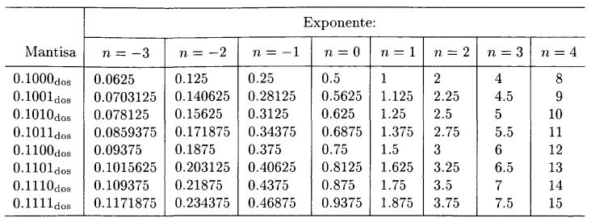

```{r setup, include=FALSE}
knitr::opts_chunk$set(echo = TRUE, comment=NA)
```


# Introducción a los Métodos Numéricos

- Son aquellos algoritmos que permiten resolver de forma aproximada problemas matemáticos que involucran el cálculo de determinados valores y no pueden ser abordados mediante técnicas analíticas, o cuya resolución analítica exacta tiene un costo o complejidad muy elevados.

- Por ejemplo, si tenemos que hallar el valor de $x \text{ tal que } x + 2 = 5$, el cálculo es muy sencillo.
- Pero se complica si tenemos que calcular:
$$ F(x_0) = \int_{-\infty}^{x_0} \frac{1}{\sqrt{2\pi}\sigma^2}e^{-\frac{1}{2} \left( {\frac{x-\mu}{\sigma}}\right)^2}dx$$

# Introducción a los Métodos Numéricos

- Es decir, el Análisis Numérico trata de diseñar métodos para aproximar, de una
manera eficiente, las soluciones de problemas expresados matemáticamente. 

- Naturalmente, a los métodos numéricos les interesa controlar la diferencia entre la solución aproximada y el valor verdadero, que recibe el nombre de **error**.

- Están relacionados con muchas disciplinas, como la algorítmica y la programación, y se aplican en diversas áreas, como en la Estadística.

- El estudio y desarrollo de los métodos numéricos abarca los siguientes aspectos:

	- Análisis de las propiedades de convergencia de los métodos numéricos
	- Estudio de la programación de los métodos numéricos (implementación)
	- Aplicación de los métodos numéricos en un determinado campo

# Introducción a los Métodos Numéricos

- Algunos de los problemas que toca el Análisis Numérico son los siguientes:
	
	- Resolución aproximada de ecuaciones algebráicas y sistemas de ecuaciones no lineales.
	- Problemas de optimización, en los que se maximiza o se minimiza una función.
	- Problemas de tipo matricial (hallar valores propios, invertir matrices, etc.)
	- Resolución de sistemas de ecuaciones lineales con gran número de ecuaciones e incógnitas que por su costo de cálculo son irresolubles por métodos clásicos como la regla de Cramer.
	- Resolución aproximada de ecuaciones diferenciales.
	- Problemas de interpolación.
	- Problemas de integración o derivación aproximada de funciones poco manejables.

# Introducción a los Métodos Numéricos

## Ejemplo 1

- No hay dudas que:
$$ (a + b) - b = a $$
- ¿Pero qué sucede si hacemos $(10^{-9} + 10^9) - 10^9$ en la calculadora?

- En esta unidad nos dedicaremos a repasar y definir conceptos relacionados con la representación numérica de magnitudes, para intentar entender qué sucedió con la operación anterior en nuestra calculadora.

# Cifras significativas

- Las cifras significativas de un número son las que aportan alguna información.
- Reglas:
	- Cualquier dígito distinto de cero es significativo. Ej: 348 tiene 3 cifras significativas.
	- Los ceros ubicados entre dos dígitos distintos de cero son significativos. Ej: 403 tiene 3 cifras significativas; 10,609 tiene 5.
	- Los ceros a la izquierda del primer dígito diferente de cero NO son significativos. Ej: 0,0042 tiene 2 cifras significativas.
	- Para números mayores que 1, los ceros que aparecen a la derecha del punto decimal SON cifras significativas. Ej: 2,0 tiene 2 cifras significativas. 
	- Para números enteros, los ceros que están después del último dígito diferente de cero, pueden ser o no cifras significativas. Ej: 700 puede tener una (el 7), 2 (70) o 3 (700) cifras significativas. Para saber cuántas son, se debe investigar cómo es el procedimiento con que se obtuvo la medida (cuál es su presición, por ejemplo).
	
	<!-- 10,093 tiene 5
	4320 tiene 4, 0.07050 tiene 4, 0.0030 tiene dos
	--> 

# Notación Científica

- Los números reales pueden tener un número finito o infinito de cifras, pero para poder trabajar con ellos siempre hay que aproximarlos a un número finito de dígitos.
- Además, conviene expresarlos de alguna manera de que independientemente de su magnitud, puedan ser visualizados de manera compacta.
- Esto ha dado lugar a la notación conocida como **científica o exponencial**, que facilita la escritura de números muy grandes o muy pequeños.

# Notación Científica

- La representación en notación científica de un número real $r$ está compuesta por:
$$r = c \times b^{e}$$

	- $c$: el coeficiente, formado por un número real.
	- $b$: la base, que en nuestro sistema decimal es 10 (pero puede ser otra, como en el sistema binario de las computadoras que es 2).
	- $e$: el exponente u "orden de magnitud", que eleva la base a una potencia.
	- Un signo en el coeficiente, que indica si el número es positivo o negativo.

- Si el coeficiente es un entero entre el 1 y el 9, seguido de una coma y de varios dígitos fraccionarios, se dice que el número está expresado con **notación científica estándar**.

# Notación Científica

## Ejemplo 2:

- El número $-2,3 x 10^3$ es $-2300$. También puede escribirse $-2,3E3$ (aquí $E$ no tiene nada que ver con la constante matemática $e$).
- El número $0,01E-7$ es $0,000000001$.
- El número $34E5$ es $3400000$.
- Sólo el primer caso está en notación exponencial estándar.
	
# Notación Científica

- Observaciones:

	- La notación científica facilita escribir y operar con números muy grandes (como los que se suelen usar en la astronomía) o muy pequeños (como en el estudio de moléculas), permitiendo resaltar las cifras significativas de un número.
	- Ej: La masa de un protón es igual a 0,00000000000000000000000000167 kg. En notación científica estándar es igual a 1,67E-27.
	
# Notación Científica

- Observaciones:
	
	- Se considera que el número de dígitos en el coeficiente es la cantidad de cifras significativas, lo cual nos ayuda resolver ciertas ambigüedades como en el ejemplo anterior del número $700$. 
	- Si está escrito como $7E2$ tiene sólo una cifra significativa, $7,0E2$ indica dos cifras significativas y $7,00E2$ indica tres.
    - Ej: La circunferencia de la Tierra en el Ecuador es $40 \, 091 \, 000 m$. Si en notación científica aparece como $4,0091E7$, entendemos que presenta 5 cifras significativas.
    
# Sistemas de numeración

- Un sistema de numeración es un conjunto de símbolos y reglas de generación que permiten construir todos los números válidos.
- Estamos acostumbrados a utilizar el sistema decimal, el cual está compuesto por 10 símbolos o cifras: 0, 1, 2, 3, 4, 5, 6, 7, 8, 9.
- En este sistema, los números se representan utilizando como base aritmética las potencias del número diez.
- Por ejemplo, el número decimal $1563$ se puede escribir en forma desarrollada utilizando potencias con base $10$ así:
$$1563 = (1 x 10^3) + (5 x 10^2) + (6 x 10^1) + (3 x 10^0)$$
- Son los coeficientes $1$, $5$, $6$ y $3$ los que definen la representación de este número como $1563$ en el sistema decimal.

# Sistemas de numeración

- Pero si en vez de usar potencias con base 10, usamos potencias con base 2, el número $1563$ se escribe como:
$$
\begin{aligned}
1563 & = (1 \times 2^{10}) + (1 \times 2^9) + (0 \times 2^8) + (0 \times 2^7) + (0 \times 2^6) + \\
& (0 \times 2^5) + (1 \times 2^4) + (1 \times 2^3) + (0 \times 2^2) + (1 \times 2^1) + (1 \times 2^0) \\
& = 1024 + 512 + 16 + 8 + 2 + 1
\end{aligned} 
$$
- Esto quiere decir que podemos usar los coeficientes anteriores para representar este número en otro sistema, en este caso, el **sistema binario** o **en base dos**:
$1563 = 11000011011_{(2)}$.

# Sistemas de numeración

- El **sistema binario** es entonces un sistema numérico donde los números se representan utilizando solamente dos cifras: 0 y 1.
- De manera general, cualquier número positivo $z$ se puede expresar en base $b$ como:
$$
\begin{aligned}
z & = (a_k \times b^k) + (a_{k-1} \times b^{k-1}) + ... + (a_1 \times b^1) + \\
& (a_0 \times b^0) + (a_{-1} \times b^{-1}) + (a_{-2} \times b^{-2}) + ...
\end{aligned} 
$$

    donde los coeficientes $a_j$ son enteros $\in \{0, 1, 2, ..., b - 1\}$. 

- Esto permite expresar a $z$ como:
$$z = {a_k a_{k-1} \dots a_1 a_0 , a_{-1} a_{-2}}_{(b)}$$
    
- La proposición anterior se conoce como el **Teorema Fundamental de la Numeración**, que establece la forma general de construir números en un sistema de numeración con cualquier base. 

# ¿Por qué nos interesa el sistema binario?

- Porque es el sistema de representación numérica que utilizan las computadoras.
- Este sistema es natural para las computadoras ya que su memoria consiste de un enorme número de dispositivos de registro electrónico, en los que cada elemento sólo tiene los estados de "encendido" y "apagado".
- Aunque nosotros no nos damos cuenta, toda operación numérica que le indicamos a la computadora en sistema decimal, es traducida y procesada internamente en binario.
- Por lo tanto es muy importante entender cómo opera la computadora, para entender qué sucede con las operaciones que queremos que realice.

# ¿Por qué nos interesa el sistema binario?

## Ejemplo 3

- Escribir un programa en IML para realizar las siguientes operaciones, empleando estructuras iterativas para las sumatorias:


    a) $10 \, 000 - \sum_{i=1}^{100 \, 000} 0,1$
    b) $10 \, 000 - \sum_{i=1}^{80 \, 000} 0,125$


- ¿Cuál es el resultado exacto en estos cálculos? ¿Qué resultados arrojó la computadora?
- Más adelante intentaremos explicar por qué se produce este error.

# Conversión de binario a decimal

- Hay que recordar que cada dígito es el coeficiente de una potencia en base 2.

## Ejemplo 4

$$
\begin{aligned}
110101_{(2)} & = 1 \times 2^{5} + 1 \times 2^{4} + 0 \times 2^{3} + 1 \times 2^{2} + 0 \times 2^{1} + 1 \times 2^{0} \\
& = 32 + 16 + 4 + 1 = 53_{(10)}
\end{aligned}
$$

## Ejemplo 5

$$
\begin{aligned}
101,101_{(2)} & = 1 \times 2^{2} + 0 \times 2^{1} + 1 \times 2^{0} + 1 \times 2^{-1} + 0 \times 2^{-2} + 1 \times 2^{-3} \\
& = 4 + 1 + 0,5 + 0,125 = 5,625_{(10)}
\end{aligned}
$$


# Conversión de decimales enteros a binario

- A la parte entera hay que divirla sucesivamente por la base 2, hasta obtener un cociente igual a cero.
- El conjunto de los restos de las sucesivas divisiones, ordenados desde el último hasta el primero, constituyen el número en formato binario.

## Ejemplo 6

$$
\begin{aligned}
123 = 61 \times 2 + 1 \\
61 = 30 \times 2 + 1 \\
30 = 15 \times 2 + 0 \\
15 = 7 \times 2 + 1 \\
7 = 3 \times 2 + 1 \\
3 = 1 \times 2 + 1 \\
1 = 0 \times 2 + 1\\
\end{aligned}
$$

De manera que $123_{(10)} = 1111011_{(2)}$.

# Conversión de números decimales fraccionarios a binario

- A la parte fraccionaria hay que multiplicarla sucesivante por 2, hasta que la misma se haga 0 o se alcance un número deseado de dígitos.
- El conjunto de los dígitos delante de la coma forman el número binario.

## Ejemplo 7

$$
\begin{aligned}
0,3125 \times 2 = & 0,625\\
0,625 \times 2 = & 1,25\\
0,25 \times 2 = & 0,5\\
0,5 \times 2 = & 1,0
\end{aligned}
$$

De manera que $0,3125_{(10)} = 0,0101_{(2)}$.

## Ejemplo 8

$123,3125_{(10)} = 1111011,0101_{(2)}$.

# Conversión de decimal a binario

- Pensemos en el número decimal $1/3 = 0,\overline3$.
- Podemos usar una cantidad finita de cifras iguales a $3$ para aproximarlo (por ejemplo, $0,333$ o $0,33333$).
- Tales aproximaciones guardan cierto error, que depende de la cantidad de cifras empleadas.
- Con los números binarios ocurre exactamente lo mismo.

# Conversión de decimal a binario

## Ejemplo 9

- Pasemos a binario el número decimal $1/10 = 0,1_{(10)}$

$$
\begin{aligned}
0,1 \times 2 = 0,2 \\
0,2 \times 2 = 0,4 \\
0,4 \times 2 = 0,8 \\
0,8 \times 2 = 1,6 \\
0,6 \times 2 = 1,2 \\
0,2 \times 2 = 0,4 \\
0,4 \times 2 = 0,8
\end{aligned}
$$

y la secuencia sigue repitiéndose...

- Es decir que $0,1_{(10)} = 0,0001100110011..._{(2)} = 0,0\overline{0011}_{(2)}$

# Conversión de decimal a binario

## Ejemplo 9 (cont.)

- La computadora necesariamente debe redondear o truncar el número $0,0\overline{0011}_{(2)}$ para almacenarlo y operar.
- Esta es la razón por la cual en el ejemplo 3 la operación que implicaba sumar 100 mil veces el $0,1$ daba error.
- Por el contrario, $0,125$ en binario no es periódico, la computadora lo puede representar exactamente y no se produjo error:

$$
\begin{aligned}
0,125 \times 2 = 0,25 \\
0,25 \times 2 = 0,5 \\
0,5 \times 2 = 1,0
\end{aligned}
$$
Es decir que $0,125_{(10)} = 0,001_{(2)}$.

<!-- Ejemplo de binario periodico a decimal: pag 20-21 de Matlab -->

# Formato coma flotante

- Los microprocesadores de las computadoras utilizan una forma especial de notación científica, con la que se puede representar números reales extremadamente grandes y pequeños de manera muy eficiente y compacta.
- Este formato se conoce como **representación en coma flotante** y no es más que notación científica con ciertas reglas particulares: la base es 2 y tanto el exponente como el coeficiente pueden contener un número restringido de cifras.
- Que haya una restricción en la cantidad de cifras implica que dada una cantidad $x$, la computadora sólo es capaz de almacenar una aproximación binaria a $x$:
$$x \approx \pm q \times 2^n$$
    donde el coeficiente $q$ recibe el nombre de mantisa y $n$ es el exponente.

# Formato coma flotante

- En general, un número de punto flotante es representado como:
$$\pm d_0, d_1 d_2 \ldots d_{p-1} \times 2^n$$
    donde en la mantisa los $p$ dígitos $d_j \in \{0, 1\}$ .
    
# Formato coma flotante

## Ejemplo 10

- Consideremos un formato en coma flotante que admite representar números positivos con la siguiente expresión:
$$0, d_1d_2d_3d_4 \times 2^n$$
    donde $d_1 = 1$ y $d_2$, $d_3$ y $d_4$ pueden ser $0$ o $1$, y $n \in \{-3, -2, -1, 0, 1, 2, 3, 4\}$.
- ¿Cuántos exponentes distintos tenemos? Ocho.
- ¿Cuántos valores distintos para la mantisa tenemos? Ocho: $0,1000; 0,1001; 0,1010; 0,1011; 0,1100; 0,1101; 0,1110; 0,1111$.
- ¿Cuántos números reales permite representar este formato? $8 \times 8 = 64$.

# Formato coma flotante

## Ejemplo 10 (cont.)

- ¿Cuáles son estos 64 números? Algunos ejemplos:

$$
\begin{aligned}
0,1000_{(2)} \times 2^{-3} &= 0,0001_{(2)} = 1 \times 2^{-4} = 0,0625 \\
0,1001_{(2)} \times 2^{-2} &= 0,001001_{(2)} = 1 \times 2^{-3} + 1 \times 2^{-6} \\
& = 0,125 + 0,015625 = 0,140625 \\
0,1010_{(2)} \times 2^{0} &= 0,1010_{(2)} = 1 \times 2^{-1} + 1 \times 2^{-3} = 0,5 + 0,125 = 0,625 \\
0,1110_{(2)} \times 2^{2} &= 11,10_{(2)} = 1 \times 2^{1} + 1 \times 2^{0} + 1 \times 2^{-1} \\
& = 2 + 1 + 0,5 = 3,5 \\
0,1111_{(2)} \times 2^{4} &= 1111_{(2)} = 1 \times 2^{3} + 1 \times 2^{2} + 1 \times 2^{1} + 1 \times 2^{0} \\
& = 8 + 4 + 2 + 1 = 15
\end{aligned}
$$

# Formato coma flotante

## Ejemplo 10 (cont.)

- La siguiente tabla reúne los 64 números y muestra las equivalencias entre el formato en coma flotante binario y las expresiones decimales:

```{r, fig.show='hold', echo=FALSE, fig.align="center", out.width='90%'}

```

# Formato coma flotante

- Obviamente, un formato que sólo admite trabajar con 64 números como el anterior resulta insuficiente. 
- Las computadoras trabajan con formatos bastante más amplios...
- Existe un estándar que establece todas las reglas que deben seguir las computadoras para representar los números en coma flotante.
- Se llama **IEEE-754** y define dos formatos muy populares: el de precisión simple (en el cual cada número ocupa 32 bits de memoria) y el de precisión doble (un número ocupa 64 bits).

# Formato coma flotante

- En el de precisión doble, se destinan:

	-  1 bit para el signo (0 es positivo, 1 es negativo)
	- 11 bits para el exponente (da lugar a $2^{11} = 2048$ valores distintos)
	- 52 bits para la mantisa (da lugar a $2^{52}$ valores distintos)

- Con este sistema, el número más pequeño que se puede almacenar es $2^{-1024} \approx 10^{-300}$ y el mayor es alrededor de $2^{1023} \approx 10^{300}$.
- A pesar de poder representar una vastísima cantidad de números reales, igualmente quedan baches o gaps con números que no pueden ser representados y son aproximados, con lo cual siempre se da lugar a cierto error de representación.

<!-- 
- Otras curiosidades:

- La representación en coma flotante no es necesariamente única, de ahí que surge la llamada "representación normalizada", en la cual el primer dígito de la mantisa debe ser 1.

	- Los ceros con signo: si el exponente y la mantisa son ceros, el número es +0 o -0 dependiendo del signo.
	- El caso de e = 2047 (los 11 dígitos del exponenete son 1) se reserva para codificar +- infty y otros objetos que se denominan NaN (Not-a-Number), que indica que una operación es ilegítima, como 1/0 o log(-2) en una operación con números reales. --> 

# Errores

- Por lo visto anteriormente, es importante tener en cuenta que las soluciones calculadas por la computadora no son soluciones matemáticas exactas.
- La precisión de una solución numérica puede verse disminuida por diversos factores que mencionaremos a continuación.
- Antes, vamos a definir dos formas de medir el error en una aproximación.

## Definiciones

Siendo $x$ el valor exacto y $\hat{x}$ su aproximación, definimos:

- Error absoluto: $E_a = |x - \hat{x}|$
- Error relativo: $E_r = \frac{|x - \hat{x}|}{|x|}, x\neq 0$

El error relativo presenta la ventaja de ser invariante a los cambios de escala, es independiente de las unidades de medida.

# Tipos de errores

## Error de truncamiento

- Ocurre cuando un número tiene más dígitos que los utilizados en las operaciones y se "olvida" una parte.
- Esto puede darse cuando una expresión matemática complicada se reemplaza por otra más simple, como cuando desarrollamos por polinomios de Taylor una función.
- Por ejemplo, el desarrollo de $f(x) = e^{x^2}$ es:
$$ e^{x^2} = 1 + x^2 + \frac{x^4}{2!} + \frac{x^6}{3!} + ... + \frac{x^{2n}}{n!} + ...$$
- Si nos quedamos sólo con los primeros 4 términos, estamos generando un error de truncamiento.

# Tipos de errores

## Error de redondeo
- Surge porque la computadora usa un número limitado de cifras en la mantisa, de manera que algunos números no coinciden exactamente con su representación.
- Por ejemplo, ya vimos que $1/10_{(10)} = 0,0\overline{0011}_{(2)}$, es decir, la representación en binario es periódico.
- Esto implica que la computadora tiene que podar o redondear para poder guardarlo, porque no puede almacenar infinitas cifras.

## Ejemplo 11: poda y redondeo

- Ejemplo: tomando el número real $x = \frac{22}{7} = 3.142857142857142857...$
- Podar con 6 cifras significativas: $\hat{x} = 3.14285$
- Redondear con 6 cifras significativas: $\hat{x} = 3.14286$

# Tipos de errores

## Pérdida de cifras significativas o error significativo

- Se produce cuando el resultado de una operación entre dos valores tiene menos cifras significativas que los originales, debido a que éstos difieren en una cantidad muy pequeña en relación a su magnitud.
- Ejemplo: sean $p = 3.1415926536$ y $q = 3.1415957341$. Tienen 11 cifras significativas cada uno.
- $p - q = -0.0000030805$. Tiene sólo 5 cifras significativas.
- Esto puede producir una reducción en la precisión final de la respuesta calculada.

# Tipos de errores

## Ejemplo 12

- Sean $f$ y $g$ dos funciones equivalentes dadas por:
$$f(x) = x \left( \sqrt{x+1} - \sqrt{x} \right)$$
$$g(x) = \frac{x}{\sqrt{x+1} + \sqrt{x} }$$
- Al valorizar estas funciones en 500, el resultado exacto es 11.174755300747198...
- Usando 6 cifras significativas con redondeo se obtiene:

$$
\begin{aligned}
f(500) &= 500 \left( \sqrt{501} - \sqrt{500} \right) \\
& = 500 (22,3830 - 22,3607)\\
& = 500(0,0223) = 11,1500 \Rightarrow E_r = 0,22\%
\end{aligned}
$$

# Tipos de errores

## Ejemplo 12 (cont.)

$$
\begin{aligned}
g(500) &= \frac{500}{\sqrt{501}} + \sqrt{500} \\
& = \frac{500}{22,3830+22,3607} = \\
& \frac{500}{44,7437} = 11.1748 \Rightarrow E_r = 0,0004\%
\end{aligned}
$$

- $g(x)$ tiene menor error y coincide con la respuesta exacta si también la redondeamos a 6 cifras decimales.

<!--
Observaciónes:
- El error de truncamiento se puede controlar.  Puede disminuirse aumentando el número de operaciones.
- El error significativo suele ser el más problemático.
-->

# Error propagado

- Es el error que se tiene al final de una cadena de operaciones sucesivas por la existencia de diferentes errores en los pasos intermedios.
- Por ejemplo, si tenemos dos valores exactos $p$ y $q$ con valores aproximados $\hat{p}$ y $\hat{q}$ cuyos errores son $\epsilon_p$ y $\epsilon_q$ de modo que $\hat{p} = p + \epsilon_p$ y $\hat{q} = q + \epsilon_q$, al realizar la suma entre los valores aproximados:
$$\hat{p} + \hat{q} = (p + \epsilon_p) + (q + \epsilon_q) = (p + q) + (\epsilon_p + \epsilon_q)$$
- El error en una suma es igual a la suma de los errores de los sumandos.

# Error propagado

- Es normal que en una cadena los errores iniciales se propaguen.
- Pero es deseable que un error pequeño en el comienzo produzca errores pequeños en el resultado final.
- Un algoritmo con esta cualidad se llama **estable** (el error se puede acotar), en caso contrario se dice **inestable**.
- Supongamos que $\epsilon$ representa un error inicial y que $\epsilon (n)$ representa el crecimiento de dicho error después de $n$ operaciones:
	
	- Si $|\epsilon (n)| \propto n \epsilon$, el crecimiento es **lineal**.
	- Si $|\epsilon (n)| \propto k^n \epsilon$, el crecimiento es **exponencial**.
		- Si $k > 1$, el error crece cuando $n \rightarrow \infty$ sin que podamos acotarlo, el proceso es inestable.
		- Si $0 < k < 1$, el error decrece cuando $n \rightarrow \infty$, se puede acotar, el proceso es estable.

&nbsp;

&nbsp;

&nbsp;

&nbsp;

&nbsp;

&nbsp;

&nbsp;

&nbsp;

&nbsp;

```{r}
":)"
```

<!-- TRABAJOS PRACTICOS OPCIONALES
Programar los algoritmos para pasar de decimal a binario y viceversa
Curso para ingenieros 

para ing pag 14

ejemplo de error de redondeo: pag 13 de aplic con software
ejemplo de la variancia cambridge p 25
--> 
