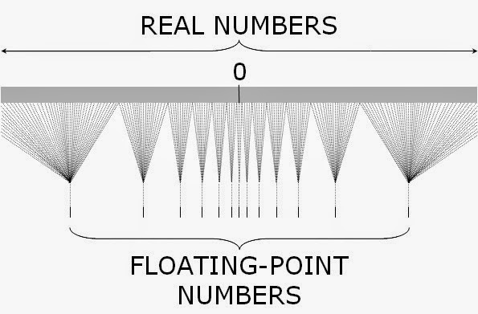
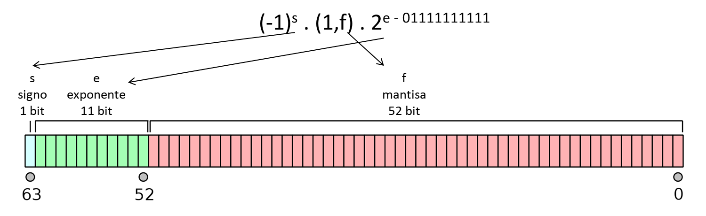

```{r setup, include=FALSE}
knitr::opts_chunk$set(echo = TRUE, fig.align = "center", message = F, comment = NA)
```


# Introducción a los Métodos Numéricos

- Son aquellos algoritmos que permiten resolver de forma aproximada problemas matemáticos que involucran el cálculo de determinados valores y no pueden ser abordados mediante técnicas analíticas, o cuya resolución analítica exacta tiene un costo o complejidad muy elevados.

- Por ejemplo, si tenemos que hallar el valor de $x \text{ tal que } x + 2 = 5$, el cálculo es muy sencillo.
- Pero se complica si tenemos que calcular:
$$ F(x_0) = \int_{-\infty}^{x_0} \frac{1}{\sqrt{2\pi}\sigma^2}e^{-\frac{1}{2} \left( {\frac{x-\mu}{\sigma}}\right)^2}dx$$

- Es decir, el Análisis Numérico trata de diseñar métodos para aproximar, de una
manera eficiente, las soluciones de problemas expresados matemáticamente. 

- Naturalmente, a los métodos numéricos les interesa controlar la diferencia entre la solución aproximada y el valor verdadero, que recibe el nombre de **error**.

- Están relacionados con muchas disciplinas, como la algorítmica y la programación, y se aplican en diversas áreas, como en la Estadística.

- El estudio y desarrollo de los métodos numéricos abarca los siguientes aspectos:

	- Análisis de las propiedades de convergencia de los métodos numéricos
	- Estudio de la programación de los métodos numéricos (implementación)
	- Aplicación de los métodos numéricos en un determinado campo

- Algunos de los problemas que toca el Análisis Numérico son los siguientes:
	
	- Resolución aproximada de ecuaciones algebráicas y sistemas de ecuaciones no lineales.
	- Problemas de optimización, en los que se maximiza o se minimiza una función.
	- Problemas de tipo matricial (hallar valores propios, invertir matrices, etc.)
	- Resolución de sistemas de ecuaciones lineales con gran número de ecuaciones e incógnitas que por su costo de cálculo son irresolubles por métodos clásicos como la regla de Cramer.
	- Resolución aproximada de ecuaciones diferenciales.
	- Problemas de interpolación.
	- Problemas de integración o derivación aproximada de funciones poco manejables.

## Ejemplo 1

- No hay dudas que:
$$ (a + b) - b = a $$
- ¿Pero qué sucede si hacemos $(10^{-9} + 10^9) - 10^9$ en la calculadora?

- En esta unidad nos dedicaremos a repasar y definir conceptos relacionados con la representación numérica de magnitudes, para intentar entender qué sucedió con la operación anterior en nuestra calculadora.

# Cifras significativas

<!-- https://www.nde-ed.org/GeneralResources/SigFigs/SigFigs.htm 
https://en.wikipedia.org/wiki/Significant_figures#Concise_rules -->

- Las cifras significativas de un número son las que aportan alguna información.
- Reglas:
	- Cualquier dígito distinto de cero es significativo. Ej: 348 tiene 3 cifras significativas.
	- Los ceros ubicados entre dos dígitos distintos de cero son significativos. Ej: 403 tiene 3; 10,609 tiene 5.
	- Los ceros a la izquierda del primer dígito diferente de cero NO son significativos. Ej: 0,0042 tiene 2.
	- En números que tienen coma decimal, ceros a la derecha son significativos. Ej: 0,050 tiene 2; 2.00 tiene 3 (estos ceros reflejan la precisión del número).
	- En números que no tienen coma decimal, ceros a la derecha pueden ser o no significativos. Ej: 700 puede tener una (el 7), 2 (70) o 3 (700) cifras significativas, dependiendo de la precisión en la obtención del número.
	- Los números exactos tienen infinitas cifras significativas pero no se reportan. Ej: si uno cuenta lápices y hay dos, el número de lápices es 2,0000...
	
# Notación Científica o Exponencial

- Es un sistema que facilita la escritura de números muy grandes o muy pequeños.
- La representación en notación científica de un número real $r$ es $r = \pm c \times b^{e}$, donde:

	- $c$: es el coeficiente (real).
	- $b$: es la base (10 en el sistema decimal, puede ser otra).
	- $e$: es el exponente u "orden de magnitud", que eleva la base a una potencia.
	- $\pm$: es el signo del coeficiente, indica si el número es positivo o negativo.

- Si el coeficiente es un entero entre el 1 y el 9, seguido de una coma y de varios dígitos fraccionarios, se dice que el número está expresado con **notación científica estándar**.

## Ejemplo 2:

- El número $-2,3 x 10^3$ es $-2300$. También puede escribirse $-2,3E3$ (aquí $E$ no tiene nada que ver con la constante matemática $e$).
- El número $0,01E-7$ es $0,000000001$.
- El número $34E5$ es $3400000$.
- Sólo el primer caso está en notación científica estándar.
	
## Otras observaciones

- La notación científica facilita escribir y operar con números muy grandes (como los que se suelen usar en la astronomía) o muy pequeños (como en el estudio de moléculas), permitiendo resaltar las cifras significativas de un número.
- Se considera que la cantidad de dígitos en el coeficiente es la cantidad de cifras significativas, lo cual nos ayuda resolver ciertas ambigüedades como en el ejemplo anterior del número $700$. Si está escrito como $7E2$ tiene sólo una cifra significativa, $7,0E2$ tiene dos y $7,00E2$ tiene tres.
- Ejemplo: La masa de un protón es igual a 0,00000000000000000000000000167 kg. En notación científica estándar es igual a 1,67E-27.
- Ejemplo: La circunferencia de la Tierra en el Ecuador es $40 \, 091 \, 000 m$. Si en notación científica aparece como $4,0091E7$, entendemos que presenta 5 cifras significativas.
	
# Sistemas numéricos

- Un sistema de numeración es un conjunto de símbolos y reglas que permiten construir todos los números válidos.
- Estamos acostumbrados a utilizar el sistema decimal, el cual está compuesto por 10 símbolos o cifras: 0, 1, 2, 3, 4, 5, 6, 7, 8, 9.
- Es un sistema posicional, es decir, la posición ocupada por cada dígito tiene un significado exacto y determina la contribución de la cifra al valor numérico. Por ejemplo, 35 y 53 tienen las mismas cifras pero significados distintos.
- Cada cifra es multiplicada por una potencia de 10, con el exponente determinado por la posición de la cifra con respecto al punto decimal.
- Por ejemplo, el número decimal $1563$ se puede escribir en forma desarrollada utilizando potencias con base $10$ así:
$$1563 = 1000 + 500 + 60 + 3 = (1 \times 10^3) + (5 \times 10^2) + (6 \times 10^1) + (3 \times 10^0)$$
- Son los coeficientes $1$, $5$, $6$ y $3$ los que definen la representación de este número como $1563$ en el sistema decimal.

- Pero si en vez de usar potencias con base 10, usamos potencias con base 2, el número $1563$ se escribe como:

$$
\begin{aligned}
1563 & = 1024 + 512 + 16 + 8 + 2 + 1  \\
    &= (1 \times 2^{10}) + (1 \times 2^9) + (1 \times 2^4) + (1 \times 2^3) + (1 \times 2^1) + (1 \times 2^0) \\
    &= (1 \times 2^{10}) + (1 \times 2^9) + (0 \times 2^8) + (0 \times 2^7) + (0 \times 2^6) + \\
&\qquad (0 \times 2^5) + (1 \times 2^4) + (1 \times 2^3) + (0 \times 2^2) + (1 \times 2^1) + (1 \times 2^0)
\end{aligned} 
$$

- Como en el sistema decimal, son los coeficientes los que definen la representación del número, por lo que $1563$ en **sistema binario** o **en base dos** es igual a $11000011011_{(2)}$.

# ¿Por qué nos interesa el sistema binario?

- Porque es el sistema de representación numérica que utilizan las computadoras.
- Este sistema es natural para las computadoras ya que su memoria consiste de un enorme número de dispositivos de registro electrónico, en los que cada elemento sólo tiene los estados de "encendido" y "apagado".
- Estos elementos constituyen la unidad mínima de información, sólo pueden tomar dos valores posibles, 0 o 1, y reciben el nombre de **bit** (*bi*nary digi*t*).
- Aunque nosotros no nos damos cuenta, toda operación numérica que le indicamos a la computadora en sistema decimal, es traducida y procesada internamente en binario.
- Por lo tanto es muy importante entender cómo opera la computadora, para entender qué sucede con las operaciones que queremos que realice. Por ejemplo...

## Ejemplo 3

- Escribir un programa para realizar las siguientes operaciones, empleando estructuras iterativas para las sumatorias:

    a) $10 \, 000 - \sum_{i=1}^{100 \, 000} 0,1$
    b) $10 \, 000 - \sum_{i=1}^{80 \, 000} 0,125$

- ¿Cuál es el resultado exacto en estos cálculos? ¿Qué resultados arrojó la computadora?

```{r}
# Item 1
suma = 0
for (i in 1:100000) suma = suma + 0.1
10000 - suma

# Item 2
suma = 0
for (i in 1:80000) suma = suma + 0.125
10000 - suma
```

- ¿Por qué ocurre esto?

    - Pensemos en el número decimal periódico $1/3 = 0,\overline3$.
    - Para aproximarlo, sólo podemos usar una cantidad finita de cifras, por ejemplo, $0,333$ o $0,33333$. Estas  aproximaciones guardan cierto error, que depende de la cantidad de cifras empleadas.
    - Con los números binarios ocurre exactamente lo mismo.
    - $0,1_{(10)} = 0,0001100110011..._{(2)} = 0,0\overline{0011}_{(2)}$. Es decir, la representación de 0,1 en binario es periódica, la computadora necesariamente debe redondear o truncar para almacenar y operar.
    - Por esta razón, sumar 100 mil veces $0,1$ no da exactmente 10000.
    - Por el contrario, $0,125$ en binario no es periódico, la computadora lo puede representar exactamente y no se produjo error.
    
# Formato de coma flotante

- La **representación de coma flotante** (en inglés, *floating point*) es una forma de notación científica usada en los computadores con la cual se pueden representar números reales extremadamente grandes y pequeños de una manera muy eficiente y compacta, y con la que se pueden realizar operaciones aritméticas. 
- El estándar que establece las reglas para este tipo de representación se llama **IEEE-754**.
- En este formato, la base es 2 y tanto el exponente como el coeficiente pueden contener una cierta cantidad limitada de cifras binarias, lo cual implica que dada una cantidad $x$, la computadora sólo es capaz de almacenar una aproximación binaria a $x$:
$$x \approx \pm m \times 2^n$$
    donde el exponente $n$ y coeficiente $m$ (también llamado **mantisa**) son números binarios con una longitud establecida.

- A través de este sistema, las computadoras sólo pueden representar un subconjunto de los números racionales y no pueden representar números irracionales como $\pi$ o $\sqrt3$ dado que tienen infinitos decimales no periódicos.
- Esto hace que en la representación surjan los errores de redondeo que ya vimos en el ejemplo 3.

```{r, out.width="50%", echo=F}

```

- El **IEEE-754** define dos tipos de formatos: el de precisión simple (en el cual cada número ocupa 32 bit de memoria) y el de precisión doble (un número ocupa 64 bit).

- El formato de doble precisión en 64 bit, empleado actualmente en casi todas las computadoras, tiene la siguiente estructura:

```{r, out.width="80%", echo=F}

```

- El bit que indica el signo, $s$, vale 0 si el número es positivo o 1 si es negativo.
- El exponente $e$ ocupa 11 bit dando lugar a $2^{11} = 2048$ valores distintos. Se dice que es un exponente sesgado porque se le resta $01111111111_{(2)} = 1023_{(10)}$, por lo que puede variar entre -1023 y 1024.
- La mantisa $(1,f)$ se registra *normalizada*, es decir con un solo dígito antes de la coma igual a 1, de manera que dicho 1 no se almacena, es implícito. Luego de la coma, la parte fraccionaria $f$ ocupa 52 bit ($2^{52}$ valores distintos).

Por ejemplo, el siguiente conjunto de 64 bit representa al número decimal -74,5 (verificación opcional).

```{r, out.width="80%", echo=F}
knitr::include_graphics("Plots/U1/floatej.png")
```

Verificación (no incluirla, que se fije quien le interese):

- Primero el exponenete: $e=10000000101_{(2)}=2^{10}+2^{2}+2^{0}=1029_{(10)}, \quad 1029-1023=6$.
- Luego la mantisa (recordar el 1 implícito): $1,0010101 \times 2^6 = 1001010,1_{(2)} = 2^{6}+2^{3}+2^{1}+2^{-1} = 74,5_{(10)}$
- El signo es $1$, por lo tanto el número es negativo $-74,5$.

En [este link](http://weitz.de/ieee/) se puede encontrar una calculadora que convierte números entre sus representaciones en decimal y en coma flotante.

## Propiedades importantes del formato IEEE-754

- Además de representar números, este sistema permite almacenar ciertos valores especiales. Uno de ellos es *NaN* (*Not a Number*), para resultados no definidos matemáticamente. Por ejemplo:

    ```{r, warning=F}
    0/0
    sqrt(-1)
    ```
    
    Operaciones como $x + NaN, NaN \times x, NaN / x, x / NaN$ resultan en $NaN$ (excepto $NaN^0 = 1$).
    
    **Observación**: en R `NaN` no es lo mismo que `NA` (*Not Available*). `NA` es una construcción de R, que no forma parte del IEEE-754, para representar valores desconocidos o faltantes.

- El infinito tiene su propia representación en este estándar y puede ser positivo o negativo. Un valor infinito puede darse como resultado de ciertas operaciones o por exceder los límites de almacenamiento. En R se representan con `Inf` y `-Inf`.

    ```{r}
    Inf
    Inf - Inf
    Inf / Inf
    ```

- La división por cero resulta en infinito, aunque matemáticamente sea una indefinición. Y como contrapartida, dividir por infinito da cero.

    ```{r}
    3/0
    -3/0
    3/Inf
    ```

- Infinito es el próximo valor al mayor valor que puede registrarse bajo este formato. En R, existe un objeto llamado `.Machine` que es una lista con información numérica de la máquina en la que se está trabajando, por ejemplo, cuál es el mayor número en coma flotante normalizada. Si a este valor lo multiplicamos, por ejemplo, por 2, tenemos infinito:

    ```{r}
    .Machine$double.xmax
    .Machine$double.xmax * 2
    ```

- El 0 tiene signo, puede ser $+0$ o $-0$. $-0$ actúa como $0$ y se muestra como $0$, pero el signo negativo se propaga en las operaciones.

    ```{r}
    -0
    3 * -0
    1 / 0
    1 / -0
    ```

- Como ya dijimos, bajo este sistema no podemos representar todos los números reales. El **error de máquina** o **epsilon de máquina** es una medida del espacio que hay entre dos números consecutivos en la computadora. Se define como el menor número $\epsilon > 0$ tal que $1 + \epsilon > 1$.

    Si bien $1 + x > 1$ debería verificarse para cualquier $x > 0$, en la computadora no es así, porque si $x$ es muy pequeño, $1 + x$ será redondeado a $1$. Por eso, el $\epsilon$ de máquina es aquella cantidad mínima necesaria para que $1 + \epsilon$ se distinga de $1$.
    
    En R, podemos averiguar el epsilon de máquina así:
    
    ```{r}
    .Machine$double.eps
    ```
    
    Podemos usar la función `print` para elegir la cantidad de decimales que queremos ver y así experimentar con el $\epsilon$ de máquina:
    
    ```{r}
    print(1 + .Machine$double.eps, digits = 20)
    print(1 + .Machine$double.eps * 2, digits = 20)
    print(1 + .Machine$double.eps / 2, digits = 20)
    ```
    
    Aunque nos parezca despreciable, esto puede ser una limitación a considerar, por ejemplo, si trabajamos con medidas de partículas subatómicas.
    
    Si hacemos 1000 + $\epsilon$, encontraremos que el resultado es 1000. Es decir, 1000 + $\epsilon$ no se distingue de 1000. Es porque $\epsilon$ está definido con respecto a 1. Como los números en coma flotante son cada vez más espaciados cuanto más nos alejamos de 0, a 1000 habrá que sumarle un $x$ algo más grande para que $1000 + x$ se distinga de 1000.
    
    ```{r}
    print(1000 + .Machine$double.eps, digits = 20)
    print(1000 + 100 * .Machine$double.eps, digits = 20)
    print(1000 + 300 * .Machine$double.eps, digits = 20)
    ```
    
- **Overflow (desbordamiento)**. Es el fenómeno que ocurre cuando un cálculo produce un resultado cuya magnitud es mayor que la que se puede almacenar o representar (en R, `.Machine$double.xmax`). Aunque este número probablemente es mucho mayor que cualquier número que utilicemos en la práctica, debería ser tenido en cuenta, por ejemplo, si hacemos cálculos en cosmología.
    
    ```{r}
    .Machine$double.xmax
    .Machine$double.xmax * 2
    ```
    
- **Underflow (desbordamiento)**. Es el fenómeno que ocurre cuando cuando el resultado de una operación en coma flotante es menor en magnitud (más cercano a cero) que el menor número representable (en R, `.Machine$double.xmin`). Es difícil mostrar un ejemplo de esto porque, dependiendo de la máquina, la representación en coma flotante puede recurrir a números no normalizados para lograr números incluso por fuera de los límites de desbordamiento:
    
    ```{r}
    # Mínimo representable en coma flotante normalizada
    .Machine$double.xmin
    # Igual es posible conseguir números menores con representación no normalizada
    .Machine$double.xmin / 2
    ```
    
    Observación: el mínimo representable `.Machine$double.xmin` es menor que el $\epsilon$ de máquina ya que los números en coma flotante son más densos alrededor del 0 que del 1.
    
# Análisis de los errores

Como ya hemos dicho, los métodos numéricos proporcionan una solución aproximada de los problemas que tratan de resolver. Y aunque es cierto que algunos de los métodos que se estudiarán idealmente proporcionarían una solución exacta, esto tampoco ocurrirá por las aproximaciones que realiza la computadora en la representación numérica.

Entonces, llamamos **error** a la diferencia entre la solución que los métodos, una vez programados, devuelven y la solución exacta del problema que se trata de resolver. Hay dos tipos fundamentales de errores:

## Error de truncamiento

Dado que un método numérico propone un algoritmo para resolver de forma aproximada un problema que no se puede resolver mediante métodos analíticos, se llama error de truncamiento a la diferencia entre el valor aproximado propuesto por el método y la solución exacta del problema.

El error de truncamiento ocurre cuando un proceso que requiere un número infinito de pasos se detiene en un número finito de pasos. Por ejemplo, podemos recordar el desarrollo en serie de Taylor de la función $f(x) = e^{x^2}$:

$$ e^{x^2} = 1 + x^2 + \frac{x^4}{2!} + \frac{x^6}{3!} + ... + \frac{x^{2n}}{n!} + ...$$

Si nos quedamos sólo con los primeros 4 términos, estamos aproximando una suma que tiene infinita cantidad de sumandos sólo con los primeros 4, de manera que dicha aproximación presentará un error de truncamiento.

Este tipo de error no depende directamente del sistema numérico que se emplee.


## Error de redondeo

El error de redondeo es el que resulta de reemplazar un número por su forma de punto flotante, es decir, por su representación en la computadora mediante un número finito de bits. Este error recibe este nombre ya sea que la aproximación se realice con redondeo o poda (también conocidoa como *truncamiento*, pero no debe confundirse con el error de truncamiento).

El error de redondeo está ligado fundamentalmente al tipo de precisión que se emplee (algo determinado por el procesador y el software usados). Sin embargo, el efecto final de los errores de redondeo depende también del algoritmo propuesto por el método numérico y por la forma de programlarlo. Por ejemplo, existen operaciones que son especialmente sensibles a los errores de redondeo o el algoritmo puede hacer que los mismos se amplifiquen en la evolución de los cálculos.

## Ejemplos de operaciones "delicadas"

- **Sustracción de números casi iguales en valor absoluto**, que da lugar a importantes pérdidas de precisión. El resultado tiene menos cifras significativas que los valores originales, produciendo lo que se conoce como **pérdida de cifras significativas** o **cancelación catastrófica**. Por ejemplo: sean $p = 3.1415926536$ y $q = 3.1415957341$. Tienen 11 cifras significativas cada uno. Sin embargo, $p - q = -0.0000030805$ tiene sólo 5 cifras significativas. Esto puede producir una reducción en la precisión final de la respuesta calculada.

- **División por cantidades pequeñas**, puesto que un error mínimo en el dividendo se traduce en uno mucho mayor en el resultado y que la falta de precisión podría ocasionar un *overflow* o pérdida de cifras significativos. Por ejemplo, cuando más adelante resolvamos sistemas de ecuaciones lineales, veremos cómo la estrategia de pivoteo del algoritmo de eliminación de Gauss trata de evitar este último problema buscando siempre el número más grande por el que se pueda dividir. Dado que los números de punto flotante están más concentrados cerca del cero entonces al dividir por un número más grande es más probable conseguir una mejor aproximación.

- **Adición de un número grande y uno pequeño**, puede hacer que el pequeño desaparezca. En ciertos casos esto no ocasiona un problema ya que, si tenemos un número de gran magnitud
probablemente podamos considerar al más pequeño despreciable. Sin embargo debe tenerse mucho cuidado con el orden de las operaciones ya que si, por ejemplo, sumamos una gran cantidad de numeros pequeños entre ellos (que juntos tienen un peso considerable) y luego se lo sumamos a un número grande, todo funcionará correctamente. Pero si vamos sumando uno por uno los números pequeños al grande entonces en cada paso el número pequeño será considerado despreciable y llegaremos a un resultado erróneo.

# Medida del error

Existen dos formas fundamentales de medir los errores que se cometen en la aproximación de la solución de un problema mediante un método numérico. Siendo $x$ el valor exacto y $\hat{x}$ su aproximación, definimos:

- **Error absoluto**: $E_a = |x - \hat{x}|$. Se mide en las mismas unidades de la variable que se trata de aproximar (por ejemplo, en amperios si se quiere aproximar la corriente que circula por un circuito eléctrico).

- **Error relativo**: $E_r = \frac{|x - \hat{x}|}{|x|}, x\neq 0$. Relaciona el error obtenido con la magnitud de la propia solución y se interpreta como porcentaje. Esta medida del error es invariante a los cambios de escala, ya que es independiente de las unidades de medida.

# Error propagado

Ciertamente, los problemas de pérdida de precisión no son tan graves hoy en día como lo eran hace unos cuantos años, debido al empleo habitual del almacenamiento en 64 bits. Sin embargo, estas cuestiones no deben ser obviadas sin más ya que pueden ser fuentes de errores que no son fácilmente detectables, o por los efectos de su propagación a lo largo de los cálculos.

Se define como **error propagado** al error que se tiene al final de una cadena de operaciones sucesivas por la existencia de diferentes errores en los pasos intermedios. Por ejemplo, si tenemos dos valores exactos $p$ y $q$ con valores aproximados $\hat{p}$ y $\hat{q}$ cuyos errores son $\epsilon_p$ y $\epsilon_q$ de modo que $\hat{p} = p + \epsilon_p$ y $\hat{q} = q + \epsilon_q$, al realizar la suma entre los valores aproximados:
$$\hat{p} + \hat{q} = (p + \epsilon_p) + (q + \epsilon_q) = (p + q) + (\epsilon_p + \epsilon_q)$$

- Si bien es normal que en una cadena los errores iniciales se propaguen, es deseable que un error pequeño en el comienzo produzca errores pequeños en el resultado final.
- Un algoritmo con esta cualidad se llama **estable** (el error se puede acotar), en caso contrario se dice **inestable**.
- Supongamos que $\epsilon$ representa un error inicial y que $\epsilon (n)$ representa el crecimiento de dicho error después de $n$ operaciones:
	
	- Si $|\epsilon (n)| \propto n \epsilon$, el crecimiento es **lineal**.
	- Si $|\epsilon (n)| \propto k^n \epsilon$, el crecimiento es **exponencial**.
		- Si $k > 1$, el error crece cuando $n \rightarrow \infty$ sin que podamos acotarlo, el proceso es inestable.
		- Si $0 < k < 1$, el error decrece cuando $n \rightarrow \infty$, se puede acotar, el proceso es estable.

