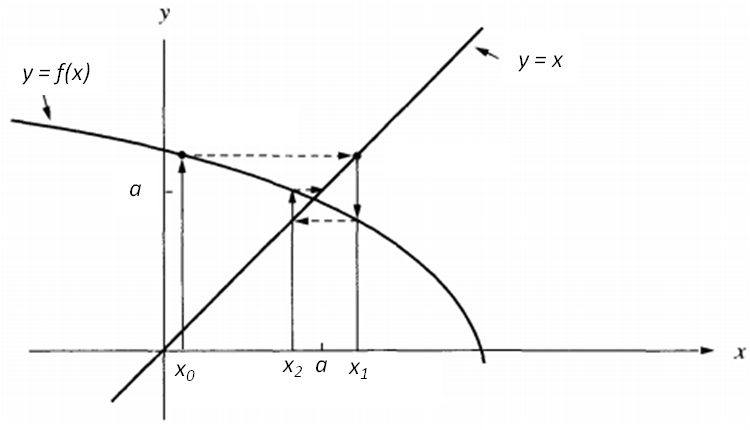
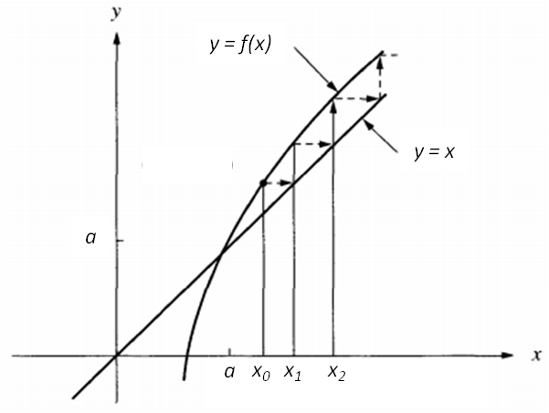
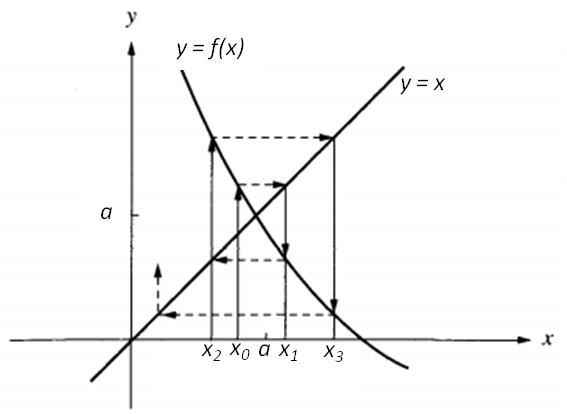
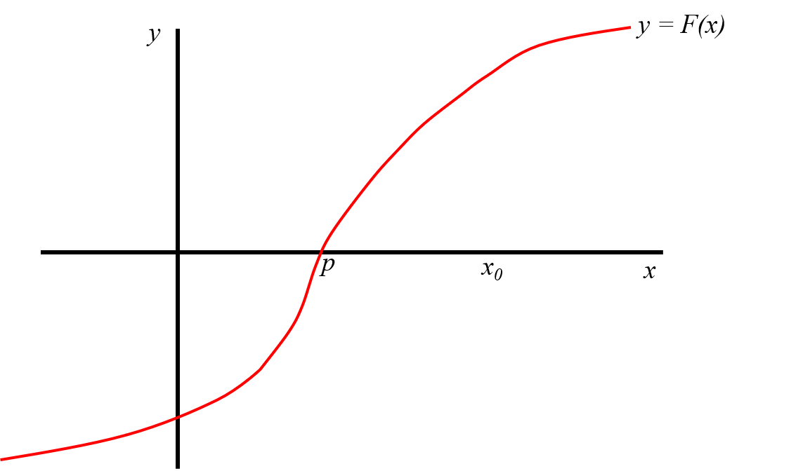
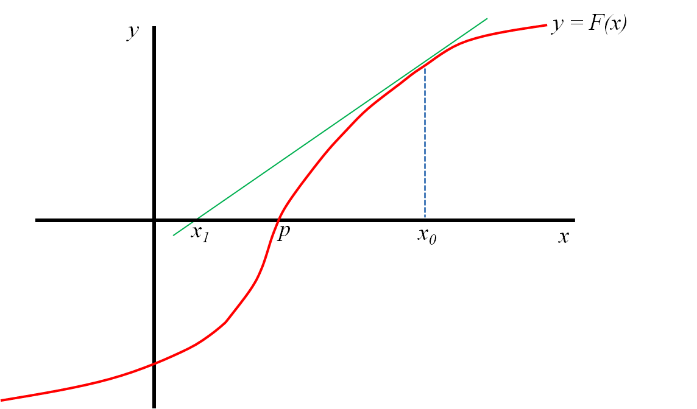
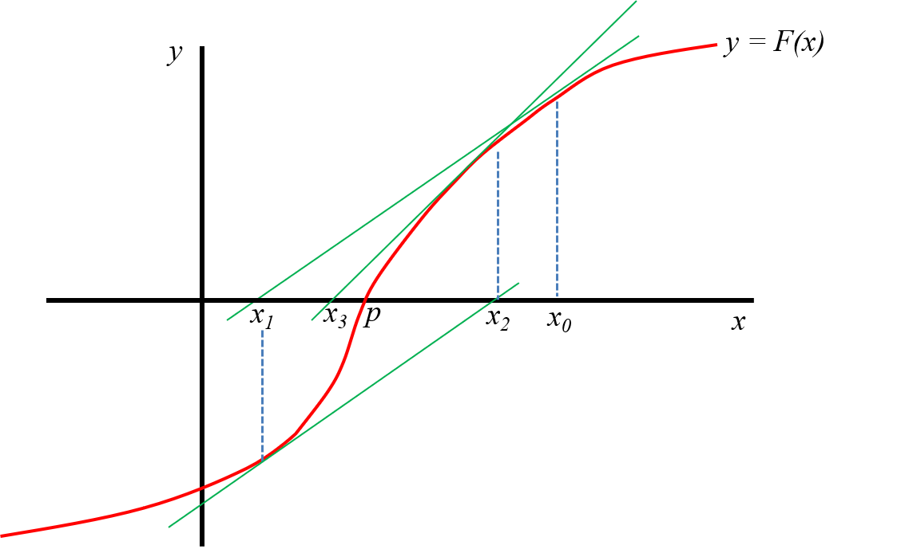
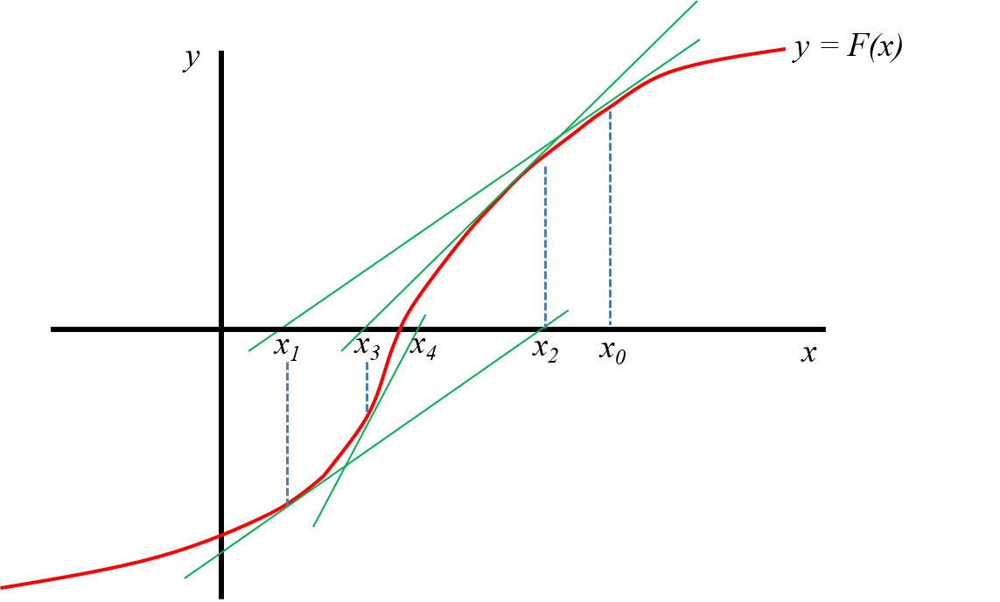

```{r setup, include=FALSE}
knitr::opts_chunk$set(echo = F, comment=NA, fig.align="center")
```

# Introducción

- Resolver ecuaciones es uno de los problemas más antiguos de la matemática.
- Se presenta en una gran variedad de problemas reales.
- Las soluciones de una ecuación se llaman **raíces** o **ceros**. 

# Introducción

- Una **ecuación lineal** es una igualdad que involucra una o más variables elevadas a la primera potencia y no contiene productos entre las variables (involucra solamente sumas y restas de las variables). Por ejemplo: $3x+2 = 8$.
- Para este tipo de ecuaciones es posible hallar analíticamente una expresión para su solución.
- En una **ecuación no lineal** las incógnitas están elevadas a potencias distintas de $1$, o aparecen en denominadores o exponentes, o están afectadas por funciones no lineales (como el logaritmo o las trigonométricas). 

# Introducción

- Un tipo de ecuación no lineal es la **ecuación algebraica**, que se trata de un polinomio igualado a cero:
$$
P_n(x) = a_0 x^n + a_1 x^{n-1} + ... + a_{n-1} x + a_n = 0
$$
    donde $a_0 \ne 0, n \in \mathbb{N}$ y $a_0, \dots, a_n$ son constantes.
    
- Ejemplo: $x^3 - x^2 + 5x - 8 = 2x^5$.
    
- Sabemos que si, por ejemplo, $n = 2$, la solución de $ax^2 + b x + c = 0$ está dada por la resolvente:

$$
x_{1,2} = \frac{b \pm \sqrt{b^2 - 4ac}}{2a}
$$

- Sin embargo, la solución análitica para este tipo de ecuaciones existe sólo para $n \le 4$. 

# Introducción

- Las restantes ecuaciones no lineales se dice que son **trascendentes**, por ejemplo:

\begin{gather*}
x^3 - ln x + \frac{3}{x} = 2 \\
tg(x + 45) = 1 + sen(2x) \\
xe^{x}=1 \\
{\displaystyle 5^{x}=9^{x+1} 3^{x}}
\end{gather*}

- En general, tampoco es posible hallar de manera análitica una solución exacta para estas ecuaciones.

# Introducción

- Excepto para algunos problemas, las ecuaciones no lineales carecen de solución exacta, por lo que requieren ser resueltas con métodos computacionales.
- Una técnica fundamental es la de la **iteración**.
- Se trata de repetir un proceso hasta que se obtiene un resultado aproximado.
- Veremos distintos métodos numéricos diseñados para encontrar las raíces, cada uno tiene con sus propias ventajas y limitaciones.

# Introducción

- En general, se tendrá una función $F(x)$ y se tratará de encontrar un valor de $x / F(x) = 0$. 
- Los métodos de solución aproximada constan de dos pasos:

    1. Determinación de un valor aproximado de la raiz que se busca.
    2. Mejoramiento de la solución hasta lograr un grado de precisión preestablecido.

# Método de las Aproximaciones Sucesivas o del Punto Fijo

**Definición de punto fijo de una función**

- Un punto fijo de una función $f(x)$ es un número real $P$ tal que $f(P)=P$.
- Ejemplos:

    - $f(x)=x^{2}-3x+4$, $2$ es un punto fijo de $f$ porque $f(2) = 2$.
    - $f(x)=x^{2}$, $0$ y $1$ son puntos fijos de $f$ porque $f(0) = 0$ y $f(1) = 1$.

<!-- 
- Geométricamente, los puntos fijos son los puntos de intersección de la curva $y=g(x)$ con la recta $y=x$.
-->

# Método de las Aproximaciones Sucesivas o del Punto Fijo

**¿Para qué todo esto del punto fijo?**

Siendo:
\setlength{\abovedisplayskip}{-30pt}
\setlength{\belowdisplayskip}{-30pt}
\begin{equation}
\label{eq:a}
F(x) = 0
\end{equation}

    una ecuación algebraica o trascendente cualquiera que se desea resolver, el **Método de las Aproximaciones Sucesivas** propone reescribirla a través de la ecuación equivalente:
    
\begin{equation}
\label{eq:b}
f(x) = x
\end{equation}

    de manera que la tarea de hallar un valor de $x$ que satisface \eqref{eq:a} es lo mismo que hallar un punto fijo de la función $f(x)$.
    
Ahora veremos cómo reescribir la ecuación y cómo encontrar un punto fijo.
    
# Método de las Aproximaciones Sucesivas o del Punto Fijo

**¿Cómo reescribir la ecuación?**

- **Opción 1**: despejando $x$ en uno de los lados de la ecuación. Ejemplo, para resolver $F(x) = x^2 - x - 1 = 0$:

\setlength{\abovedisplayskip}{-25pt}
\setlength{\belowdisplayskip}{-8pt}
\begin{gather*}
\underbrace{x^2 - x - 1}_{F(x)} = 0 \implies \underbrace{1 + \frac{1}{x}}_{f(x)} = x
\end{gather*}

<!-- en este ej tomando como valor inicial a 2 converge
Si sumaramos x a cada lado no converge (con valor inical 2 se hacen)
nros enormes enseguidas, con 1.6 se excede el nro de iteraciones -->

- **Opción 2**: sumar $x$ a cada lado de $F(x) = 0$. Ejemplo, para resolver $F(x) = x^2 - 8 = 0$:

\begin{gather*}
\underbrace{x^2 - 8}_{F(x)} = 0 \implies \underbrace{x^2 + x - 8}_{f(x)} = x
\end{gather*}

<!-- este ejemplo lo borre porque era como sumar x a cada lado
- **Opción 1**: despejando $x$ en uno de los lados de la ecuación (lo cual no siempre es fácil). Ejemplo, para resolver $F(x) = 2 sen(\sqrt{x}) - x = 0$:

\setlength{\abovedisplayskip}{-25pt}
\setlength{\belowdisplayskip}{-8pt}
\begin{gather*}
\underbrace{2 sen(\sqrt{x}) - x}_{F(x)} = 0 \\
\underbrace{2 sen(\sqrt{x})}_{f(x)} = x
\end{gather*}
-->

# Método de las Aproximaciones Sucesivas o del Punto Fijo

**¿Cómo encontrar un punto fijo de $f(x)$?**

\begin{teorema}[1]
\label{TeoPuntoFijo}

Sea $f$ una función continua y $p_0, p_1, \dots, p_n, \dots$ una sucesión generada a partir de $p_{n} = f(p_{n-1})$ con un valor inicial $p_0$, es decir:

\setlength{\abovedisplayskip}{-5pt}
\setlength{\belowdisplayskip}{-5pt}
\begin{gather*}
p_0 \\
p_1 = f(p_0) \\
p_2 = f(p_1) \\
\vdots \\
p_n = f(p_{n-1}) \\
\vdots \\
\end{gather*}

Si $lim_{n\to\infty} p_n = P$, entonces $P$ es un punto fijo de $f(x)$.
\end{teorema}

<!-- 
Demostracion pag 48, hoja 59 de MATLAB
-->

# Método de las Aproximaciones Sucesivas o del Punto Fijo

Entonces el método para resolver $F(x) = 0$ consiste en:

1. Expresar la ecuación en la forma $x = f(x)$.
2. Elegir un valor inicial adecuado $x_0$.
3. Realizar el siguiente cálculo iterativo:

\setlength{\abovedisplayskip}{-20pt}
\setlength{\belowdisplayskip}{-25pt}
\begin{gather*}
x_1 = f(x_0) \\
x_2 = f(x_1) \\
\vdots \\
x_n = f(x_{n-1}) \\
\vdots \\
\end{gather*}

- Si a medida que $n$ crece los $x_n$ se aproximan a un valor fijo, se dice que el método converge y la iteración se detiene cuando la diferencia entre dos valores consecutivos $x_{n-1}$ y $x_n$ sea tan pequeña como se desee. 
- El valor $x_n$ será una raíz aproximada de $F(x)$.

# Método de las Aproximaciones Sucesivas o del Punto Fijo

- Ejemplo: buscar la raíz negativa de $F(x) = x^2 - 0,5$.

# Método de las Aproximaciones Sucesivas o del Punto Fijo

**Interpretación gráfica**

- Dado que el método plantea encontrar el valor de $x$ que satisface $x = f(x)$, resolver la ecuación original es equivalente a resolver el sistema:

\begin{equation}
  \begin{cases}
    y = f(x) \\
    y = x
  \end{cases}
\end{equation}

- Es decir, que geométricamente el valor buscado es el punto de intersección de la curva $y=f(x)$ con la recta $y=x$.
- Hacer esquemas (general y para el ejemplo anterior).

# Método de las Aproximaciones Sucesivas o del Punto Fijo

**Criterios para detener el proceso iterativo**

- Criterios para convergencia:

1. Error absoluto: $|x_{j+1}-x_j| < \epsilon$

2. Error relativo: $\left|\frac{x_{j+1}-x_j}{x_j}\right| < \epsilon$

3. Error relativo respecto al valor inicial: $\left|\frac{x_{j+1}-x_j}{x_0}\right| < \epsilon$

4. $|F(x_j)| < \epsilon$

<!-- En el material de Viviana se repetian las 1, 2, y 3 pero con f(x) en lugar de x. Como f(x_{j+1}) = x_{j+2}, es lo mismo!!! -->

# Método de las Aproximaciones Sucesivas o del Punto Fijo

**Criterios para detener el proceso iterativo**

- Criterios para divergencia:

1. $j > r$, $r$ número máximo de iteraciones

2. $|x_j - x_1| > k$

3. $|F(x_j)| > k$

4. $|x_{j+1}-x_j| > k$

5. $\left|\frac{x_{j}}{x_1}\right| > k$

# Método de las Aproximaciones Sucesivas o del Punto Fijo

**Teorema para la convergencia del método**

\begin{teorema}[2. Teorema del Punto Fijo]
\label{TeoPuntoFijo2}

Dadas las siguientes condiciones:

\begin{enumerate}[(a)]
\item $f$ es una función continua en el intervalo $[a, b]$
\item $f(x) \in [a, b] \quad \forall x \in [a, b]$
\item $f'$ existe en $(a, b)$ con $|f'(x)| \le m < 1 \quad \forall x \in (a, b)$
\end{enumerate}

Si $x_0$ es cualquier número en $[a, b]$, entonces la sucesión definida por
$$ x_n = f(x_{n-1}), \quad n \ge 1,$$
\end{teorema}

# Método de las Aproximaciones Sucesivas o del Punto Fijo

Evaluar convergencia en el ejemplo anterior.

# Método de las Aproximaciones Sucesivas o del Punto Fijo

**Ejemplos de convergencia:**

- Convergencia monótona ($0 < f'(x) < 1$, $a$ es la raíz):

```{r, out.width="75%", echo=F}
knitr::include_graphics("Plots/conMon.png")
```

# Método de las Aproximaciones Sucesivas o del Punto Fijo

**Ejemplos de convergencia:**

- Convergencia oscilante ($-1 < f'(x) < 0$, $a$ es la raíz):

```{r, out.width="75%"}

```

# Método de las Aproximaciones Sucesivas o del Punto Fijo

**Ejemplos de divergencia:**

- Divergencia monótona ($f'(x) > 1$, $a$ es la raíz):

```{r, out.width="65%"}

```

# Método de las Aproximaciones Sucesivas o del Punto Fijo

**Ejemplos de divergencia:**

- Divergencia oscilante ($f'(x) < -1$, $a$ es la raíz):

```{r, out.width="65%"}

```

# Método de Newton-Raphson

- Si la función $F$ y sus derivadas $F'$ y $F''$ son continuas cerca de una raíz $p$, se pueden usar estas características de $F$ para desarrollar algoritmos que produzcan sucesiones $\{x_k\}$ que converjan a $p$ más rápidamente.
- El método de **Newton-Raphson** es uno de los más útiles y conocidos.
- Vamos a introducir este método a partir de su interpretación geométrica y su representación gráfica.
- **Recordar**: La *tangente* a una curva en un punto es una recta que toca a la curva solo en dicho punto.
- Veamos el siguiente ejemplo donde el objetivo es hallar la raiz de la función $F$, es decir, el valor $p$ tal que $F(p) = 0$.

# Método de Newton-Raphson


```{r, out.width="90%"}

```

# Método de Newton-Raphson


```{r, out.width="90%"}

```

# Método de Newton-Raphson


```{r, out.width="90%"}
knitr::include_graphics("Plots/nr3.png")
```

# Método de Newton-Raphson


```{r, out.width="90%"}

```

# Método de Newton-Raphson


```{r, out.width="90%"}

```

# Método de Newton-Raphson

- Supongamos que contamos con una aproximación inicial $x_0$ cercana a la raiz $p$.
- Definimos a $x_1$ como el punto de intersección del eje de las abscisas con la recta tangente a la curva $F$ en $x_0$.
- En el caso de la figura, se puede observar que $x_1$ está más cerca de $p$ que $x_0$.
- Ahora definimos a $x_2$ como el punto de intersección del eje de las abscisas con la recta tangente a la curva $F$ en $x_1$.
- Nuevamente, para el caso del ejemplo, podemos ver cómo $x_2$ está aún más cerca de $p$.
- Si continuamos repitiendo este proceso, esperamos encontrar un $x_n$ que sea una buena aproximación para $p$.

# Método de Newton-Raphson

- ¿Podemos expresar esto que observamos gráficamente a través de una fórmula?
- Es decir, a partir de $x_0$, ¿podemos encontrar una fórmula para $x_1$?
- Sí, para eso hay prestarle atención a la pendiente $m$ de la recta tangente en $x_0$.
- Por un lado, sabemos que la pendiente de la recta tangente a la curva en un punto es igual a la derivada de la función en dicho punto: 

\setlength{\abovedisplayskip}{-30pt}
\setlength{\belowdisplayskip}{-30pt}
\begin{equation}
\label{eq:deriv1}
m = F'(x_0)
\end{equation}

# Método de Newton-Raphson

- Pero además sabemos que para cualquier recta, la pendiente es igual a:

\setlength{\abovedisplayskip}{-50pt}
\setlength{\belowdisplayskip}{-50pt}
\begin{equation}
\label{eq:deriv2}
m = \frac{y_1 - y_0}{x_1 - x_0}
\end{equation}

    siendo $(x_0, y_0)$ y $(x_1, y_1)$ dos puntos distintos que pertenecen a la misma.
    
- Teniendo que el valor de la recta tangente en $x_0$ es $y_0 = F(x_0)$ y que el valor de la recta tangente en $x_1$ es $y_1 = 0$, nos queda:

\setlength{\abovedisplayskip}{-100pt}
\setlength{\belowdisplayskip}{-100pt}
\begin{equation}
\label{eq:deriv3}
m = \frac{0 - F(x_0)}{x_1 - x_0} = - \frac{F(x_0)}{x_1 - x_0}
\end{equation}

# Método de Newton-Raphson

- Igualando (\ref{eq:deriv1}) y (\ref{eq:deriv3}) y despejando $x_1$ nos queda:

\setlength{\abovedisplayskip}{-100pt}
\setlength{\belowdisplayskip}{-100pt}
\begin{equation}
\label{eq:deriv4}
x_1 = x_0 - \frac{F(x_0)}{F'(x_0)}
\end{equation}

- Si repetimos este pensamiento empezando desde $x_1$ con la recta tangente a $F$ en el punto $x_1$, vamos a encontrar que:

\setlength{\abovedisplayskip}{-100pt}
\setlength{\belowdisplayskip}{-100pt}
\begin{equation}
\label{eq:deriv5}
x_2 = x_1 - \frac{F(x_1)}{F'(x_1)}
\end{equation}

- De esta manera hemos deducido una fórmula recursiva que nos permitirá hallar una aproximación para el verdadero valor de la raiz de $F$.

# Método de Newton-Raphson

- Las ideas anteriores se formalizan analíticamente a través del siguiente teorema.
- En el mismo se deduce la fórmula recursiva a partir del desarrollo en serie de Taylor de la función $F$.

## Teorema de Newton-Raphson

Supongamos que la función $F$ es continua, con derivada segunda continua en el intervalo $[a; b]$, y que existe un número $p \in [a; b]$ tal que $F(p) = 0$. Si $F'(p) \neq 0$, entonces existe $\delta > 0$ tal que la sucesión $\{x_k\}_{k=0}^{\infty}$ definida por el proceso iterativo

$$
x_k = x_{k-1} - \frac{F(x_{k-1})}{F'(x_{k-1})} \quad k = 1, 2, \dots
$$

converge a $p$ cualquiera sea la aproximación inicial $x_0 \in [p - \delta; p + \delta]$

# Método de Newton-Raphson

**Observación**: para garantizar la convergencia, $\delta$ debe ser elegido tal que:
$$\frac{|F(x)F''(x)|}{[F'(x)]^2} < 1  \quad \forall x \in [p - \delta, p + \delta]$$

Esto significa que:

- $x_0$ debe estar suficientemente cerca a la raíz de $F(x) = 0$.
- $F''(x)$ no debe ser excesivamente grande.
- $F'(x)$ no debe estar muy próxima a cero.

# Método de Newton-Raphson

- Ejemplo: buscar la raíz negativa de $F(x) = x^2 - 0,5$.

# Método de Newton-Raphson

**Ventajas**

- Aparece $F$ en lugar de $f$.
- Converge más rápido que el método de las aproximaciones sucesivas.
- En algunos casos en que aproximaciones sucesivas diverge, N-R converge.
- Se puede adaptar para hallar raíces complejas.

**Limitaciones**

- Si $x_0$ está demasiado lejos de la raíz deseada, la sucesión $\{x_k\}$ puede converger a otra raíz (la pendiente $F'(x_0)$ es muy pequeña).
- Obtener la derivada primera de la función $F$ puede ser difícil o imposible. En ese caso se podría aproximar $F'(x_{k-1})$ con:
$$F'(x_{k-1}) \approx \frac{F(x_{k-1} + h) - F(x_{k-1})}{h}$$
    donde $h$ es un valor pequeño, por ejemplo, $h = 0,001$.

# Método de von Mises

- En el método de N-R, el denominador $F'(x_k)$ hace que geométricamente se pase de una aproximación a la siguiente por la tangente de la curva $y = F(x)$ en el punto correspondiente a la aproximación presente $x_k$.
- Esto puede producir problemas cuando se esté en puntos alejados de raíces y cerca de puntos donde el valor de $F'(x)$ sea cercano a 0 (tangentes cercanas a la horizontal).
- Para resolver este problema, von Mises sugirió sustituir $F'(x_k)$ en el denominador por $F'(x_0)$.
- Es decir, obtener geométricamente las siguientes aproximaciones por medio de rectas paralelas siempre a la primera tangente.
- La fórmula de recurrencia resultante es:

$$
x_k = x_{k-1} - \frac{F(x_{k-1})}{F'(x_{0})} \quad k = 1, 2, \dots
$$

# Método de von Mises

```{r, out.width="75%", echo=F}
knitr::include_graphics("Plots/vonMises.png")
```

# Método de Newton-Raphson de 2º Orden

- Otra modificación al método de N-R se deriva a partir de la utilización de un término más en el desarrollo por serie de Taylor de la función $F(x)$.
- Dada la existencia de las correspondientes derivadas, la fórmula de recurrencia resultante es:

$$
x_k = x_{k-1} + \frac{F(x_{k-1})F'(x_{k-1})}{0.5 F(x_{k-1}) F''(x_{k-1}) - [F'(x_{k-1})]^2} \quad k = 1, 2, \dots
$$

- El método de N-R de 2º orden llega más rápidamente a la raíz, aunque la fórmula es más difícil de obtener.

<!-- 
# Método de Von Mises

Continuar

# Método de Newton de 2° Orden

Continuar
    
 -->
 
<!-- 
para la practica o tp

- Aprox Suc: ejemplo opcion 1 de re escribir la ecuacion:
en este ej tomando como valor inicial a 2 converge
Si sumaramos x a cada lado no converge (con valor inical 2 se hacen)
nros enormes enseguidas, con 1.6 se excede el nro de iteraciones

- Aprox Suc: me gusta el ejemplo hoja 60 pais vasco, distintas maneras de despejar la x 

- Aprox Suc: aca hay un ejemplo con un despeje q da bien y otro que no
https://www.youtube.com/watch?v=OLqdJMjzib8

- NR: los problemas de newton raphson, pag 86
https://rpubs.com/aaronsc32/newton-raphson-method

-->


&nbsp;

&nbsp;

&nbsp;

&nbsp;

```{r, echo = T}
":)"
```

